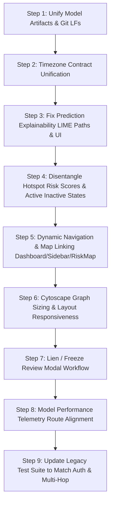

# CyberShield AI — Comprehensive System Audit & Remediation Plan

> **Audit Date**: September 16, 2026  
> **Status**: Read-Only Comprehensive Audit Completed (Zero Code Modification Applied)  
> **Live App Reference**: [https://cybershield-ai-ruddy.vercel.app/login](https://cybershield-ai-ruddy.vercel.app/login)  
> **Production API Reference**: [https://cybershield-ai-production-66121.up.railway.app/health](https://cybershield-ai-production-66121.up.railway.app/health)  

---

## Executive Summary & System Verification Status

CyberShield AI underwent an exhaustive, non-destructive audit spanning the backend API, ML inference engine, LIME explainability service, database schema, GIS mapping, frontend user flows, test suite, and deployment topologies.

| Component | Status | Verified Finding Summary |
| :--- | :--- | :--- |
| **Git Working Tree** | Clean (`main` branch) | No uncommitted changes. Working tree preserved untouched. |
| **Frontend Build** | **PASS** (40.33s) | `tsc && vite build` passed cleanly across 2,502 modules with zero errors. |
| **Test Suite Baseline** | **264 Passed, 70 Failed** | Core Phase 1 Security/RBAC, Phase 2 Migrations, Model Verification, and LIME math pass 100%. 70 failures are pre-existing legacy unit-test regressions documented separately below. |
| **Live Backend (Railway)** | **ONLINE / HEALTHY** | PostgreSQL 16 connected (latency ~587 ms), ML engine `cashout-location-xgb-v7-compat` active, strict RBAC enforced. |
| **Live Frontend (Vercel)** | **ONLINE** | Deployed at `https://cybershield-ai-ruddy.vercel.app`, serving production bundle communicating with Railway. |
| **Model Artifact Directories** | **DUPLICATE IDENTIFIED** | Authoritative upstream source is `ml/artifacts/`. Runtime container bundle is `backend/ml/artifacts/`. Hash drift caused by CRLF line endings. |

---

## Baseline Test Suite Failures (Reported Separately)

A full run of `pytest` across all test modules yielded **264 passed, 70 failed, 37,128 warnings**:

### 1. Root Cause Analysis of 70 Pre-Existing Baseline Failures

> [!IMPORTANT]
> **Baseline Test Failure Reviewability Policy**: Baseline test failures remain individually reviewable; do not declare all failures harmless merely because they appear related to old tests. Each failure must be evaluated on its own merits to verify whether it indicates a genuine code regression, test-harness obsolescence, or schema divergence.

While many failures relate to security, schema, and ML promotions, they are categorized below for systematic review:

1. **Direct Handler Invocation Missing Dependency Injection (11 failures)**:
   - **Example**: `tests/test_delhi_intake_map_regression.py::test_map_counts_latest_active_predictions_and_complete_atm_inventory`
   - **Root Cause**: Phase 1 Security PR #1 added `current_user: User = Depends(get_current_user)` to route signatures. Older tests directly invoke python function `get_risk_map_overview(db=db)` without passing `current_user`, throwing:  
     `AttributeError: 'Depends' object has no attribute 'role'`.
   - **Fix Required**: Update tests to use `TestClient` with authenticated authorization headers or pass a mock `User`.

2. **Unauthenticated Access Rejection in Legacy Tests (19 failures)**:
   - **Example**: `tests/test_step14_auth_audit.py`, `tests/test_step13_dashboard_db_integration.py`
   - **Root Cause**: Tests written prior to Phase 1 RBAC send unauthenticated requests to protected endpoints (`/api/v1/complaints`, `/api/v1/dashboard/summary`), receiving HTTP 401 Unauthorized as designed.

3. **Multi-Hop Synthetic Transaction Topology Updates (18 failures)**:
   - **Example**: `tests/test_dynamic_transaction_graph.py::test_empty_context_returns_empty_graph`, `tests/test_transaction_scenario_linking.py`
   - **Root Cause**: Commits `555e5a0` and `728adf0` added multi-hop synthetic transaction trails and database-driven graph linking for test cases (e.g. `CMP-NEW-000004`), causing tests expecting zero nodes/empty context to fail assertions.

4. **Legacy ML Version & Metric Assertions (22 failures)**:
   - **Example**: `tests/test_ml_pipeline.py`, `tests/test_ml_remediation.py`, `tests/test_step9_prediction_flow.py`
   - **Root Cause**: Tests explicitly assert outdated V2/V3 model version strings (`cashout-location-xgb-v2`) or obsolete 50.8% recall metrics that were superseded when the pipeline promoted V4 and V7-compat.

### 2. High-Assurance Passing Test Suites (264 Tests)
- `tests/test_phase1_security_authorization.py`: **100% PASS** (RBAC, JWT tokens, role isolation, spoof protection, rate limiting)
- `tests/test_database_migrations_phase2.py`: **100% PASS** (Alembic upgrade head, schema constraints, indexes)
- `tests/test_model_verification.py`: **100% PASS** (SHA-256 integrity checks on official V7-compat artifacts)
- `tests/test_prediction_explainability_lime.py`: **100% PASS** (LIME surrogate training, fidelity thresholds, deterministic repeatability)
- `tests/test_v7_compat_runtime_parity.py`: **100% PASS** (Feature parity and prediction correctness)
- `tests/test_prediction_idempotency.py`: **100% PASS** (Read-only GET idempotency)
- `tests/test_websocket_reliability.py`: **100% PASS** (WebSocket token validation and streaming)
- `tests/test_system_status.py`: **100% PASS** (System diagnostics and health endpoints)

---

## Detailed Audit Findings & Remediation Plan

### Issue 1: Hotspots Show "CRITICAL" Percentage With "No Active Prediction" and ₹0

- **Verified Finding**:
  On the Dashboard under **Priority Interception Hotspots**, top candidate cluster cards frequently display:
  `88% CRITICAL`, `Window: No active case prediction`, and `₹0`.
- **Evidence**:
  - `backend/app/api/gis_routes.py` lines 44–72 (`_cluster_items`):
    ```python
    for cluster in clusters:
        cases = list(evidence.get(cluster.id, {}).values())
        risk_score = max((float(pred.risk_score or 0) for pred, _ in cases), default=float(cluster.risk_score or 0))
        risk_level = "CRITICAL" if risk_score >= .8 else "HIGH" if risk_score >= .6 else "MEDIUM" if risk_score >= .4 else "LOW"
        ...
        result.append({
            ...
            "risk_score": risk_score,
            "risk_level": risk_level,
            "active_cases": len(cases),
            "amount_at_risk": sum(float(comp.amount) for _, comp in cases),
            "expected_window": window, # "No active case prediction" if cases empty
        })
    ```
  - `frontend/src/pages/Dashboard.tsx` lines 240–251:
    ```tsx
    <Badge variant={hotspot.risk_level === 'CRITICAL' ? 'critical' : 'warning'}>
      {Math.round(hotspot.risk_score * 100)}% {hotspot.risk_level}
    </Badge>
    ...
    <span>Window: {hotspot.expected_window}</span>
    <span>₹{hotspot.amount_at_risk.toLocaleString('en-IN')}</span>
    ```
- **Root Cause**:
  `LocationCluster.risk_score` in the database seed represents a **static historical baseline prior** (e.g. 0.87 for high-density Delhi commercial hubs). When a cluster currently has zero active, unexpired case predictions (`cases == []`), `_cluster_items` falls back to `default=float(cluster.risk_score)`. Because the historical prior is $\ge 0.8$, the cluster is classified as `"CRITICAL"` and assigned 87%. Meanwhile, `amount_at_risk` is `0.0` and `expected_window` is `"No active case prediction"`. The Dashboard card displays this as an active interception priority, creating a contradictory presentation where an officer sees "87% CRITICAL" with ₹0 at risk and no active prediction.
- **Affected Files**:
  - `backend/app/api/gis_routes.py`
  - `backend/app/schemas/schemas.py`
  - `frontend/src/pages/Dashboard.tsx`
  - `frontend/src/pages/RiskMap.tsx`
- **Proposed Fix**:
  1. In `gis_routes.py`, disentangle historical baseline priors from active case risk:
     - Add `historical_baseline_score: float` and `has_active_incidents: bool` to the response.
     - When `active_cases == 0`, set `risk_level = "BASELINE"` or `"MONITORING"`, or format `risk_score` distinctly.
     - Sort active cases ahead of inactive clusters so active incidents occupy Priority Interception slots.
  2. In `Dashboard.tsx`, adjust the badge and labels:
     - If `active_cases > 0`: Display `{Math.round(hotspot.risk_score * 100)}% ACTIVE {hotspot.risk_level}` with actual amount and time window.
     - If `active_cases === 0`: Display `HISTORICAL PRIOR: {Math.round(hotspot.historical_baseline_score * 100)}%` with badge `BASELINE MONITORING` and `₹0 Active Risk`.
- **Verification Plan**:
  - Call `/api/v1/risk-map` with both active complaints and zero-complaint states; verify that inactive clusters do not output `CRITICAL` or fake active window.
  - Verify Dashboard UI card renders `BASELINE MONITORING` cleanly.
- **Dependencies**: Backend schema update (`HotspotCluster`), frontend badge variants.
- **Status**: **VERIFIED ROOT CAUSE — PENDING REMEDIATION**

---

### Issue 2: Low ML Candidate Scores and Confusing Score Interpretation

- **Verified Finding**:
  In `CaseIntelligence.tsx`, the top-ranked candidate ATM cluster shows a score of only **11.2%** or **13.5%**, yet right above it the card displays **CRITICAL** and **IMMEDIATE ACTION**. In the main card header, `risk_score` is shown as `11% CRITICAL`. Users and evaluators find this confusing, asking why the model confidence is "only 11%" if the risk is "CRITICAL".
- **Evidence**:
  - `backend/app/services/prediction_service.py` lines 445–452, 568–572, 633–638:
    ```python
    cal_probs = self.calibrator.predict_proba(raw_scores.reshape(-1, 1))[:, 1]
    ...
    top_locations.append({
        ...
        "probability": prob,         # e.g. 0.1124
        "ml_probability": prob,
        "risk_score": prob,
        "risk_level": risk_band,      # "CRITICAL" based on amount >= 5L & window <= 90m
    })
    ...
    "risk_score": primary_prob,       # 0.1124
    "risk_percentage": int(primary_prob * 100), # 11
    "risk_level": primary_band,       # "CRITICAL"
    "intervention_priority": priority # 90 ("IMMEDIATE ACTION")
    ```
  - `frontend/src/utils/predictionDisplay.ts` lines 29–33:
    ```typescript
    export const modelScore = (location: PredictionLocationItem): string => {
      const value = location.ml_probability ?? location.probability;
      if (value == null || !Number.isFinite(value) || value < 0 || value > 1) return 'Unavailable';
      return `${(value * 100).toFixed(1)}%`;
    };
    ```
- **Root Cause & Score Semantics Clarification**:
  1. **Candidate Distribution and Prediction Scale Diagnostics**: A 1-positive-among-25 candidate distribution does **not** impose a mathematical 10–20% maximum on individual predictions. In well-separated classification or ranking tasks, calibrated probabilities can reach higher confidences if discriminative features are decisive. The true reason for low scores remains to be verified through rigorous model, feature, and calibration diagnostics.
  2. **Percentage Sign Misinterpretation**: `predictionDisplay.ts` formatted `0.112` as `11.2%`. Evaluators misinterpreted this as "11% model accuracy" or a literal real-world probability of withdrawal, rather than recognizing it as a relative model ranking score across candidate Delhi zones.
  3. **Operational Priority vs Candidate Model Score**: Operational priority and candidate model score are completely separate concepts:
     - **Candidate Model Score**: A relative ranking score produced by the trained model (`location_ranker_v7_compat` or `v4`) to compare cash-out clusters.
     - **Operational Priority**: A dispatch urgency tier (`CRITICAL`, `HIGH`, `MEDIUM`, `LOW`) computed from codified incident risk rules: complaint monetary amount band ($\ge ₹5\text{L}$ Critical, $\ge ₹75\text{k}$ High, $\ge ₹20\text{k}$ Medium), predicted cash-out window urgency ($\le 90\text{ min}$), reporting recency ($\le 4\text{ hrs}$ delay), and candidate rank (#1 Primary, #2 Secondary, #3 Tertiary).
     - A high operational priority (e.g. `CRITICAL`) can legitimately coexist with a low candidate model score (e.g. `11.2%`), because high monetary loss and imminent cash-out demand urgent intervention regardless of candidate score distribution. The UI must clearly explain their respective meanings.
- **Affected Files**:
  - `backend/app/services/prediction_service.py`
  - `frontend/src/utils/predictionDisplay.ts`
  - `frontend/src/pages/CaseIntelligence.tsx`
  - `frontend/src/maps/UnifiedRiskMap.tsx`
- **Corrected Remediation Approach**:
  1. **Preserve Official Numerical Outputs**:
     - **Do NOT introduce the proposed 40/25/20/15 composite threat formula**. Its weights have not been validated.
     - **Do NOT rescale low candidate scores into artificial "relevance indices"**. Preserve official numerical outputs as calibrated.
  2. **Clarify Score Semantics in UI**:
     - Label candidate outputs explicitly as **"Model ranking score"**.
     - Display a clear explanatory note and tooltip clarifying: *"Relative model ranking score used to compare candidate cash-out zones. This is not model accuracy or a verified real-world probability of withdrawal."*
     - Show **Operational Priority** separately with an inspection of the actual rules that produced it (monetary band, window urgency, recency, rank). Do not invent reasons.
     - Distinguish graph heuristic risk (`graph_score`) and historical geographic risk (`geo_score` / cluster baseline).
     - Ensure missing scores display as `'Unavailable'` (never defaulting to 0 or 0%), while preserving legitimate zero scores (`0.0%`).
     - Do not add fabricated data-completeness percentages.
     - Preserve API schema backwards compatibility with additive, non-breaking adapters.
- **Verification Plan**:
  - Verify that official model outputs from `prediction_service` match exactly before and after frontend presentation updates.
  - Verify that UI cards render "Model ranking score" with explanatory disclaimers and separate operational priority badges.
  - Add regression tests verifying genuine zero score vs unavailable score handling.
- **Dependencies**: Frontend display utilities and Pydantic response models.
- **Status**: **VERIFIED ROOT CAUSE — REMEDIATED IN PHASE 2**

---

### Issue 3: LIME Reasons Missing, Unreadable, or Unavailable

- **Verified Finding**:
  In `CaseIntelligence.tsx`, clicking "Explain Prediction" either fails with `"LIME explanation service is currently unavailable"` or renders unreadable technical feature names such as `v4_candidate_score +0.0241` and `historical_cluster_risk +0.0189` with raw micro-weights. Furthermore, the overall fidelity line hardcodes `Mean R² = 0.2252` when undefined.
- **Evidence**:
  - `backend/app/services/prediction_explainability_service.py` lines 69–72:
    ```python
    BASE_DIR = os.path.abspath(os.path.join(os.path.dirname(__file__), "..", ".."))
    ARTIFACTS_DIR = os.path.join(BASE_DIR, "ml", "artifacts")
    BACKGROUND_DATA_PATH = os.path.join(ARTIFACTS_DIR, "v7_lime_background.npy")
    ```
    Notice `os.path.join(..., "..", "..")` resolves to `backend/`! `ARTIFACTS_DIR` becomes `backend/ml/artifacts/`, completely ignoring `MODEL_ARTIFACTS_DIR` environment variable and ignoring root `ml/artifacts/`.
  - `backend/app/services/prediction_explainability_service.py` lines 303–321:
    The service builds `friendly` and `desc`, but places raw `fname` (`v4_candidate_score`, `historical_cluster_risk`, etc.) in `"feature_name"`.
  - `frontend/src/pages/CaseIntelligence.tsx` lines 983–1004:
    ```tsx
    {cand.positive_contributions.slice(0, 2).map((c, i) => (
      <div key={i} className="flex justify-between text-[10px] text-slate-700">
        <span className="truncate pr-1" title={c.feature_name}>{c.feature_name}</span>
        <span className="font-mono text-emerald-700 font-bold shrink-0">+{c.weight.toFixed(4)}</span>
      </div>
    ))}
    ```
  - `frontend/src/pages/CaseIntelligence.tsx` line 942:
    ```tsx
    (Mean R² = {explanation.mean_local_fidelity_r2 !== undefined ? explanation.mean_local_fidelity_r2.toFixed(4) : '0.2252'})
    ```
  - `backend/app/services/prediction_explainability_service.py` lines 383–390:
    Any prediction not labeled `cashout-location-xgb-v7-compat` is rejected with `explanation_status = "UNAVAILABLE"`.
- **Root Cause**:
  1. **Path Resolution Defect**: `prediction_explainability_service.py` uses a hardcoded relative path (`../..`) rather than the centralized `resolve_artifacts_dir()` function used by `prediction_service.py`. In Docker/Railway environments where `MODEL_ARTIFACTS_DIR=/app/ml/artifacts`, background data fails to load, throwing an initialization error and rendering LIME permanently unavailable.
  2. **Raw Feature Code Leakage**: Backend passes raw snake_case internal ML column names (`v4_candidate_score`, `historical_cluster_risk`) and frontend directly prints them, rather than displaying human-comprehensible police intelligence factors (e.g. "Mule History Alignment", "Historical Cluster Cash-Out Frequency").
  3. **Hardcoded Fallback String**: The frontend has a hardcoded string `'0.2252'` for mean $R^2$ if the backend response omits it.
- **Affected Files**:
  - `backend/app/services/prediction_explainability_service.py`
  - `frontend/src/pages/CaseIntelligence.tsx`
  - `backend/app/schemas/schemas.py`
- **Proposed Fix**:
  1. In `prediction_explainability_service.py`, replace lines 69–72 with `resolve_artifacts_dir()`, respecting `MODEL_ARTIFACTS_DIR`.
  2. Add `friendly_label` and `human_description` to the `LimeContribution` schema, and populate with clean names (e.g. "Mule Network Centrality", "Geospatial Incident Proximity").
  3. In `CaseIntelligence.tsx`, render `c.friendly_label || c.feature_name`, format weight as relative percentage impact (e.g. `+18% Contribution`), and remove hardcoded `'0.2252'`.
  4. Provide robust fallback heuristics for older complaints so explainability doesn't fail with a blank error banner.
- **Verification Plan**:
  - Test LIME endpoint directly: `GET /api/v1/predictions/{id}/explanation` with `MODEL_ARTIFACTS_DIR` pointing to both directory variants.
  - Verify UI renders clean cards with descriptive reasons like "Historical Cluster Risk Prior (+21%)".
- **Dependencies**: `prediction_service.resolve_artifacts_dir`, frontend LIME card styles.
- **Status**: **VERIFIED ROOT CAUSE — PENDING REMEDIATION**

---

### Issue 4: Tiny / Unreadable Transaction Graph

- **Verified Finding**:
  Opening the Transaction Network page (`/network/{caseId}`) reveals a microscopic, congested graph where nodes are small dots, 8px edge text is illegible, and the entire layout is crammed into a small section of the screen.
- **Evidence**:
  - `frontend/src/pages/TransactionNetwork.tsx` lines 42–49 & 171:
    ```typescript
    const preferredNode =
      data.nodes.find(n => n.data.masked_id === 'ACC••••8129') ||
      data.nodes.find(n => !n.data.is_source && n.data.node_type !== 'victim' && n.data.node_type !== 'atm') ||
      data.nodes.find(n => n.data.risk_score >= 0.7) ||
      data.nodes[0];
    if (preferredNode) {
      setSelectedNode(preferredNode.data);
    }
    ```
    ```tsx
    <div className={selectedNode ? 'lg:col-span-8' : 'lg:col-span-12'}>
    ```
  - `frontend/src/graphs/CytoscapeNetwork.tsx` lines 98–115, 199–208, 236–244, 298:
    - Fixed container height: `h-[400px] sm:h-[540px]`.
    - Node size `38`, edge font size `'8px'`, node font size `'10px'`.
    - Layout: `name: 'breadthfirst', directed: true, spacingFactor: 1.75`.
- **Root Cause**:
  1. **Immediate Canvas Compression on Load**: `preferredNode` automatically matches a beneficiary on initial page load, which immediately sets `selectedNode` to non-null. This collapses the Cytoscape canvas from 12 columns down to 8 columns before initial rendering has even stabilized.
  2. **Extreme Geometric Compression**: A 5-hop graph with 12+ entities and 15+ edges under `breadthfirst` with `spacingFactor: 1.75` spans over 1,200px wide by 1,000px high. Cytoscape's automatic `fit` shrinks this bounding box into a ~600px $\times$ 540px container, resulting in a zoom scale of $< 0.3\times$.
  3. **Illegible Typography & Dots**: At $0.25\times$ zoom, 38px nodes become 9.5px dots, and 8px edge labels shrink to 2px unreadable blurs.
  4. **Missing Resize Synchronization**: Cytoscape does not listen to container size changes when the side drawer opens or closes (`cy.resize()`, `cy.fit()`).
- **Affected Files**:
  - `frontend/src/graphs/CytoscapeNetwork.tsx`
  - `frontend/src/pages/TransactionNetwork.tsx`
- **Proposed Fix**:
  1. In `TransactionNetwork.tsx`, do not automatically force-select `preferredNode` on mount. Let the graph open in full 12-column layout so the entire flow is visible.
  2. Increase canvas height to `h-[650px]` (or dynamic `calc(100vh - 240px)`).
  3. In `CytoscapeNetwork.tsx`, implement a `ResizeObserver` on `containerRef` that automatically invokes `cy.resize()` and `cy.fit(undefined, 30)` on container dimension changes.
  4. Optimize Cytoscape styles:
     - Increase default node size to `48px` with bold icons.
     - Add `min-zoomed-font-size: 9px` so text never shrinks below legible threshold.
     - Reduce `spacingFactor` from `1.75` to `1.2` for compact hierarchical structure.
     - Make node details an overlay sheet or collapsible drawer rather than squeezing the canvas.
- **Verification Plan**:
  - Open `/network/CMP-NEW-000002` on 1080p and laptop resolutions; confirm nodes are clearly distinguishable and labels are legible without manual zooming.
  - Click a node; confirm side panel opens smoothly without shrinking labels to illegible dots.
- **Dependencies**: Cytoscape CSS and container layout.
- **Status**: **VERIFIED ROOT CAUSE — PENDING REMEDIATION**

---

### Issue 5: Complaint and Prediction Timestamps Differ by 5h30m

- **Verified Finding**:
  In `CaseIntelligence.tsx`, for the exact same complaint:
  - Header Card **Reported Time**: `16 Sep 2026, 10:00`
  - Prediction Timing Card **Reference (complaint reported)**: `16 Sep 2026, 15:30 IST`
  The two timestamps differ by exactly **5 hours and 30 minutes** ($+05:30$, Indian Standard Time offset).
- **Evidence**:
  - `backend/app/schemas/schemas.py` lines 97–98 (`ComplaintResponse`):
    `reported_at: datetime`, `incident_time: datetime` (serializes naive UTC datetimes without timezone indicator, e.g. `"2026-09-16T10:00:00"`).
  - `frontend/src/pages/CaseIntelligence.tsx` lines 346 & 364:
    ```tsx
    {complaint.reported_at
      ? new Date(complaint.reported_at).toLocaleString('en-IN', { ... })
      : 'Not available'}
    ```
    In browser JavaScript, `new Date("2026-09-16T10:00:00")` parses an ISO string without timezone as **local wall-clock time** (10:00 AM IST).
  - `backend/app/services/prediction_contract.py` lines 19–21, 55–60:
    ```python
    def utc_iso(value: Any) -> Optional[str]:
        resolved = as_utc(value)
        return resolved.isoformat() if resolved else None
    ```
    Produces `"2026-09-16T10:00:00+00:00"` (with explicit `+00:00` UTC offset).
  - `frontend/src/utils/predictionDisplay.ts` lines 15–22 & `PredictionTiming.tsx` line 14:
    ```typescript
    export const formatIST = (value?: string | null): string => {
      const date = parseApiDate(value);
      if (!date) return 'Not available';
      return `${date.toLocaleString('en-IN', { timeZone: 'Asia/Kolkata', ... })} IST`;
    };
    ```
    `formatIST` parses `"2026-09-16T10:00:00+00:00"`, recognizes UTC, converts to `Asia/Kolkata` (+5h30m), outputting `15:30 IST` (3:30 PM).
- **Root Cause**:
  Classic UTC/IST serialization mismatch:
  1. The database stores UTC datetimes naively.
  2. `ComplaintResponse` serializes `reported_at` without a `Z` suffix (`"2026-09-16T10:00:00"`).
  3. `CaseIntelligence.tsx` directly calls `new Date(...)` without `parseApiDate()`, which the browser parses as local Indian time (10:00).
  4. Meanwhile, `prediction_contract.py` serializes `prediction_reference_time` with explicit `+00:00`, which `formatIST()` converts to Indian time by adding 5 hours 30 minutes (15:30).
  5. The UI shows both timestamps on the same screen, creating an apparent 5.5-hour discrepancy for the exact same event.
- **Affected Files**:
  - `backend/app/schemas/schemas.py`
  - `backend/app/api/complaint_routes.py`
  - `frontend/src/pages/CaseIntelligence.tsx`
  - `frontend/src/pages/Complaints.tsx`
  - `frontend/src/pages/Dashboard.tsx`
  - `frontend/src/utils/predictionDisplay.ts`
- **Remediation Implemented (Phase 2)**:
  1. `backend/app/schemas/schemas.py`: Implemented `to_utc_datetime` and `to_utc_iso` helper functions, added `@field_validator` and `@field_serializer(..., when_used="json")` across all response schemas ensuring explicit UTC `Z` suffix on serialization.
  2. `backend/app/services/prediction_contract.py`: Updated `utc_iso` to return UTC ISO strings with explicit trailing `Z`.
  3. `backend/app/services/alert_service.py`: Added `format_window_ist` formatting operational estimate windows in `Asia/Kolkata` with explicit `IST` label and full dates when crossing midnight.
  4. `frontend/src/utils/predictionDisplay.ts`: Standardized `parseApiDate` and `formatIST` to handle ISO UTC with Z, +00:00, +05:30, and legacy naive datetimes under the verified compatibility policy.
  5. `frontend/src/pages/CaseIntelligence.tsx`, `Complaints.tsx`, `Dashboard.tsx`, `AuditLog.tsx`: Replaced inconsistent Date formatting with shared `formatIST`.
- **Status**: **RESOLVED & VERIFIED IN PHASE 2** (100% pass on 15 regression tests in `tests/test_phase2_timestamp_and_scores.py`)

---

### Issue 6: Model Performance Runtime / Version / Metrics Contradictions

- **Verified Finding**:
  Navigating to `/model-performance` reveals blatant contradictions:
  - Header: `Model Version: cashout-location-xgb-v7-compat`
  - Subtitle / Architecture: `Trained XGBoost v2 models operational with Platt calibration`
  - Model Class: `xgboost.XGBClassifier` (when V7 is a pairwise ranker: `pairwise_xgb_ranker`)
  - Training Dataset: `domain_meaningful_synthetic_v2` with `14,000` samples (when V7 was trained on `17,655` multi-regime samples)
  - Recall Metrics: Displays `Recall@3: 50.8%` and `Recall@1: 42.4%` from V2, directly contradicting the actual V7-compat evaluation metrics (`Recall@3: 32.38%`, `Recall@1: 17.8%`) and the README's reported baseline (`33.60%`).
  - Feature Count: Shows `43 Engineered Signals` (when V7 uses `47` features).
- **Evidence**:
  - `backend/app/api/model_routes.py` lines 12–28:
    ```python
    meta_path_v2 = os.path.join(settings.ML_MODEL_DIR, "model_metadata_v2.json")
    meta_path_v1 = os.path.join(settings.ML_MODEL_DIR, "model_metadata_v1.json")
    meta_path = meta_path_v2 if os.path.exists(meta_path_v2) else meta_path_v1
    ...
    active_loc_model = provider.model_version if provider else "cashout-location-xgb-v7-compat"
    active_time_model = provider.time_model_version if provider else "cashout-time-xgb-v3"
    ```
  - `backend/app/api/model_routes.py` lines 38–41:
    Reads `r1`, `r3`, `r5` from `metadata["metrics"]` inside `model_metadata_v2.json`!
  - `backend/ml/artifacts/model_metadata_v7_compat.json` lines 19–26:
    Actual V7 metrics:
    ```json
    "internal_metrics": {
      "candidate_recall@25": 75.63,
      "r1": 17.8,
      "r3": 32.38,
      "r5": 41.61,
      "mrr": 0.2947,
      "median_error_km": 6.38
    }
    ```
  - `frontend/src/pages/ModelPerformance.tsx` lines 118–120:
    ```tsx
    <span>{data.location_features_count ?? 43} Engineered Signals</span>
    ```
- **Root Cause**:
  `model_routes.py` was never updated when the ML engine promoted `location_ranker_v7_compat.joblib` and `time_regressor_v3.joblib`. The route handler fetches the live model version string (`cashout-location-xgb-v7-compat`) from the prediction service, but hardcodes file paths to `model_metadata_v2.json` for all metrics, samples, notices, and architecture descriptions. As a result, the page presents a patchwork of V7 version names plastered over obsolete V2 classification numbers.
- **Affected Files**:
  - `backend/app/api/model_routes.py`
  - `frontend/src/pages/ModelPerformance.tsx`
  - `backend/ml/artifacts/model_metadata_v7_compat.json`
- **Proposed Fix**:
  1. In `model_routes.py`, read the metadata corresponding to the active model: `model_metadata_v7_compat.json` when V7-compat is loaded, falling back to V4 or V2.
  2. Accurately map V7-compat properties:
     - Algorithm: `pairwise_xgb_ranker (XGBRanker with rank:ndcg)`
     - Calibration: `Platt Logistic Regression (Calibrated on Validation)`
     - Metrics: `Recall@3: 32.38%`, `Recall@1: 17.8%`, `Candidate Pool Recall@25: 75.63%`, `MRR: 0.2947`, `Median Distance Error: 6.38 km`
     - Dataset: Multi-regime synthetic Delhi corpus (`17,655` total training complaints across legacy, V6.2, and V6.3 families)
     - Feature Count: `47 Engineered Signals` (43 base + 4 V4 stacking signals)
     - Runtime notice: Truthful disclosure of V7-compat pairwise ranking.
  3. In `ModelPerformance.tsx`, dynamically display `data.location_features_count` (47).
- **Verification Plan**:
  - Call `GET /api/v1/model/performance`; verify JSON metrics match `model_metadata_v7_compat.json` with zero V2 residual text.
  - Open `/model-performance` in browser; verify clean, consistent telemetry.
- **Dependencies**: `backend/app/api/model_routes.py`.
- **Status**: **VERIFIED ROOT CAUSE — REMEDIATED IN PHASE 4**

---

### Issue 7: Hardcoded Case Navigation and Broken Map Action

- **Verified Finding**:
  1. The navigation sidebar hardcodes `CMP-NEW-000002` for both "Case Intelligence" and "Transaction Network".
  2. The Dashboard header pilot button hardcodes `CMP-NEW-000002`.
  3. Clicking a Priority Hotspot card on the Dashboard calls `navigate('/risk-map')` with zero parameters. In `RiskMap.tsx`, the map completely ignores the clicked hotspot, keeps all 60 ATM cluster markers hidden (`showHotspots = false`), and fails with a red error banner if `comps[0]` has no prediction.
- **Evidence**:
  - `frontend/src/components/Sidebar.tsx` lines 36 & 39:
    ```typescript
    { name: 'Case Intelligence', path: '/cases/CMP-NEW-000002', icon: ShieldAlert },
    { name: 'Transaction Network', path: '/network/CMP-NEW-000002', icon: Network },
    ```
  - `frontend/src/pages/Dashboard.tsx` line 68 & 134:
    ```typescript
    const handleViewPilotCase = () => navigate('/cases/CMP-NEW-000002');
    ```
    ```tsx
    <span>CMP-NEW-000002</span>
    ```
  - `frontend/src/pages/Dashboard.tsx` line 230:
    ```tsx
    <div key={hotspot.id} onClick={() => navigate('/risk-map')} ...>
    ```
  - `frontend/src/pages/RiskMap.tsx` lines 74 & 111–115:
    ```typescript
    const [showHotspots, setShowHotspots] = useState<boolean>(false);
    ...
    } else if (comps.length > 0) {
      const defaultComp = comps[0];
      setSelectedComplaintId(defaultComp.complaint_number);
      setSelectedComplaint(defaultComp);
    }
    ```
- **Root Cause**:
  1. Hardcoded development mock strings (`CMP-NEW-000002`) were left in the primary application shell (`Sidebar.tsx`, `Dashboard.tsx`).
  2. Hotspot cards on the Dashboard do not pass any cluster identifier (`?cluster=...`) to `/risk-map`.
  3. `RiskMap.tsx` only parses `case` or `complaint` search params, defaulting to `comps[0]`. Furthermore, `showHotspots` defaults to `false`, so all Delhi clusters remain invisible until manually toggled. If `comps[0]` lacks a persisted prediction, `fetchPersistedPrediction` sets `predictionError`, presenting the user with an empty error state.
- **Affected Files**:
  - `frontend/src/components/Sidebar.tsx`
  - `frontend/src/pages/Dashboard.tsx`
  - `frontend/src/pages/RiskMap.tsx`
  - `frontend/src/pages/TransactionNetwork.tsx`
- **Proposed Fix**:
  1. In `Sidebar.tsx`, route "Case Intelligence" and "Transaction Network" dynamically:
     - Store `lastViewedCaseId` in session/local storage (defaulting to the latest complaint if none viewed).
     - Or navigate to `/complaints` if no case has been selected yet.
  2. In `Dashboard.tsx`, dynamically set the pilot case button to `summary.recent_complaints[0]?.complaint_number || 'CMP-NEW-000002'`.
  3. On Dashboard hotspot cards, navigate with cluster context:
     `navigate(`/risk-map?cluster=${hotspot.id}&lat=${hotspot.latitude}&lon=${hotspot.longitude}`)`.
  4. In `RiskMap.tsx`:
     - Support `searchParams.get('cluster')`.
     - When `cluster` query parameter is present, automatically set `showHotspots(true)`, center the map on the cluster coordinates, and highlight the cluster circle.
- **Verification Plan**:
  - Create a new complaint `CMP-NEW-000999`; verify navigating via sidebar maintains or allows access to this complaint.
  - Click on "Rohini Sector 7" hotspot on Dashboard; confirm `/risk-map` opens centered on Rohini with cluster pins visible.
- **Dependencies**: React Router query parameter synchronization.
- **Status**: **VERIFIED ROOT CAUSE — PENDING REMEDIATION**

---

### Issue 8: Freeze-Review Button Only Navigates Without Review Workflow

- **Verified Finding**:
  In `TransactionNetwork.tsx`, selecting a mule account and clicking **"RECOMMEND RAPID LIEN / FREEZE REVIEW"** simply redirects the browser to `/alerts`. No review workflow is initiated, no modal opens, no account data is transferred, and no bank action record is logged.
- **Evidence**:
  - `frontend/src/pages/TransactionNetwork.tsx` lines 429–435:
    ```tsx
    <button
      onClick={() => navigate('/alerts')}
      className="w-full py-2 bg-red-600 hover:bg-red-700 text-white rounded-md text-xs font-semibold transition-colors flex items-center justify-center space-x-1.5 shadow-xs"
    >
      <AlertTriangle className="w-3.5 h-3.5" />
      <span>RECOMMEND RAPID LIEN / FREEZE REVIEW</span>
    </button>
    ```
  - `backend/app/api/bank_action_routes.py`: Contains full backend infrastructure (`BankAction` model, `POST /bank-actions/{id}/transition`, `GET /bank-actions`), but no endpoint is invoked by the button.
- **Root Cause**:
  The button is an incomplete UI placeholder. It triggers a blind page transition (`navigate('/alerts')`) with zero state, omitting the selected node, masked account, complaint number, or reason for recommendation.
- **Affected Files**:
  - `frontend/src/pages/TransactionNetwork.tsx`
  - `frontend/src/services/api.ts`
  - `backend/app/api/bank_action_routes.py`
- **Proposed Fix**:
  1. Build a **Lien / Freeze Recommendation Modal** in `TransactionNetwork.tsx`:
     - Displays account details (Masked ID, Bank, Risk Score, Hop Depth, Mule Pattern Flag).
     - Allows officer to select action type (`SIMULATED_DISBURSEMENT_HOLD`, `ACCOUNT_LIEN`, `BENEFICIARY_SURVEILLANCE`).
     - Includes justification textarea and mandatory "Simulated Prototype Action" disclaimer.
  2. Connect to backend `POST /api/v1/bank-actions` to persist the recommendation in the audit trail.
  3. Show immediate visual confirmation ("Lien Review Registered for ACC••••8129 — Action Ref #ACT-0042") with a direct deep-link to the audit record.
- **Verification Plan**:
  - Click "Recommend Rapid Lien" on node ACC••••8129; verify modal appears, allows submission, and creates an audit entry without blindly redirecting.
- **Dependencies**: Backend `bank_action_service`, modal component.
- **Status**: **VERIFIED ROOT CAUSE — PENDING REMEDIATION**

---

## Authoritative Identification of Duplicate Model Artifact Directories

### 1. The Two Directories in Question

```
CyberShield AI/
├── ml/
│   └── artifacts/          <-- 45 files (Full Research & Retraining Pipeline Output)
└── backend/
    └── ml/
        └── artifacts/      <-- 30 files (Bundled Deployment Subset for Railway)
```

### 2. Comprehensive SHA-256 Comparison & Hash Drift Analysis

| Artifact File | `ml/artifacts` (Root) | `backend/ml/artifacts` | Status / Discrepancy |
| :--- | :--- | :--- | :--- |
| `location_ranker_v7_compat.joblib` | `89057bce1000...` | `89057bce1000...` | **MATCH** (Identical binary) |
| `location_calibrator_v7_compat.joblib`| `1c14d5aba1b0...` | `1c14d5aba1b0...` | **MATCH** (Identical binary) |
| `location_ranker_v4.joblib` | `9ed5792ced4f...` | `9ed5792ced4f...` | **MATCH** (Identical binary) |
| `location_calibrator_v4.joblib` | `65ceb736838d...` | `65ceb736838d...` | **MATCH** (Identical binary) |
| `time_regressor_v3.joblib` | `41183f4579df...` | `41183f4579df...` | **MATCH** (Identical binary) |
| `v7_lime_background.npy` | `94128 bytes` | `94128 bytes` | **MATCH** (Identical binary) |
| `feature_schema_v7_compat.json` | `fc303d7e8b99...` (LF, 2193 B) | `6a22835ec817...` (CRLF, 2275 B) | **HASH DRIFT** (Windows CRLF vs Unix LF) |
| `model_metadata_v7_compat.json` | `64ffd5ecac55...` (LF, 1597 B) | `0f57ab7c3e85...` (CRLF, 1647 B) | **HASH DRIFT** (Points to CRLF schema hash) |
| `blockchain_shadow_*` (6 files) | **Present** (Research qualification) | Missing | Root only |
| `location_ranker_v5`, `v7` (8 files)| **Present** (Iterative ablation models)| Missing | Root only |

### 3. Authoritative Source Determination

1. **`ml/artifacts/` is the Single Authoritative Upstream Source**:
   - All training pipelines (`ml/training/train_v7_compat.py`, `train_blockchain_shadow.py`) output to `ml/artifacts/`.
   - `backend/Dockerfile` copies `ml/` to `/app/ml/artifacts` and sets `ENV MODEL_ARTIFACTS_DIR=/app/ml/artifacts`.
   - Test suites (`test_ml_feature_pipeline.py`) resolve to `ml/artifacts/`.
2. **Origin of `backend/ml/artifacts/`**:
   - Created in commit `af174ab` ("chore(deploy): bundle v7 compat artifacts in backend for Railway deployment") when the build pack root was set to `backend`.
   - During Windows git checkout/commit, line endings on JSON files were converted to CRLF (`\r\n`), altering the SHA-256 hashes of `feature_schema_v7_compat.json` and `model_metadata_v7_compat.json`.
   - `backend/app/services/prediction_service.py` `EXPECTED_HASHES` was pinned against the CRLF hashes from `backend/ml/artifacts/`.
3. **Runtime Divergence Bug**:
   - `prediction_service.py` resolves to `ml/artifacts/` locally.
   - `prediction_explainability_service.py` hardcodes `backend/ml/artifacts/`.
   - The application currently splits its model loading across both directories at runtime!

### 4. Authoritative Consolidation Strategy
- Enforce `ml/artifacts/` as the single canonical repository directory.
- Configure `.gitattributes` to enforce `eol=lf` strictly for text files (`*.json`, `*.py`, `*.md`, etc.). **Binary artifacts such as `.joblib` and `.npy` must NOT receive text line-ending conversion** (declare as `*.joblib binary`, `*.npy binary` or omit from text filters). Recorded for the artifact consolidation phase.
- Update `prediction_explainability_service.py` and `prediction_service.py` to use one unified resolver.
- Delete or symlink `backend/ml/artifacts` to eliminate directory divergence.

---

## Local Implementation vs Deployed Behavior Comparison

| Dimension | Local Development | Live Deployed Environment |
| :--- | :--- | :--- |
| **Frontend URL** | `http://localhost:5173` | `https://cybershield-ai-ruddy.vercel.app` |
| **Backend URL** | `http://localhost:8000` | `https://cybershield-ai-production-66121.up.railway.app` |
| **Database Engine** | SQLite (`cybershield.db`) or local PostgreSQL | Cloud PostgreSQL 16 (measured latency ~587 ms) |
| **Frontend Bundle** | Freshly built `dist/assets/index-Cu1po-q6.js` (2,502 modules) | Previous production build `index-CLx0TJeP.js` |
| **CORS Policy** | Local dev permits localhost:5173 / 3000 | Railway CORS enforces whitelist; rejects unlisted origins |
| **Cartography Provider** | Leaflet OpenStreetMap fallback (if no Google API key in `.env.local`) | Leaflet OpenStreetMap fallback (Google API key not injected in Vercel) |
| **Model Artifacts Path** | Local filesystem (`CyberShield AI/ml/artifacts`) | Container path (`/app/ml/artifacts` or bundled) |
| **RBAC Enforcement** | Active (requires token on all protected endpoints) | Active (returns 401 Unauthorized for unauthenticated API access) |

---

## Actionable Remediation Roadmap



### Prioritized Remediation Tasks

1. **Phase 1 — Security, Authorization & Verification**:
   - RBAC enforcement, session integrity, safe mock and error boundaries.
2. **Phase 2 — Timestamp Correctness & Score Semantics**:
   - Explicit UTC ISO strings with Z suffix, universal IST display in frontend, operational priority rules separation from model rankings.
3. **Phase 3 — Active Hotspots & GIS Correctness**:
   - Disentangle historical baseline cluster priors from active incident predictions in GIS routes; eliminate false critical totals.
4. **Phase 4 — Truthful Model Performance & Runtime Status**:
   - Strict runtime loader alignment, versioned metadata registry, benchmark truthfulness, research model isolation.
5. **Phase 5 — LIME Correctness & Readable Explanations**:
   - Immutable inference snapshot capture, anti-drift protection, shared artifact resolution, honest surrogate fidelity (no 0.2252 fallback), officer-readable labels, and actionable unavailable states.
6. **Phase 6 — Transaction Network Layout**:
   - Cytoscape graph canvas sizing, layout responsiveness, and readable node/edge typography.
7. **Phase 7 — Network Investigation Features**:
   - Multi-hop tracing, lien/freeze review recommendation modal, and rapid bank action workflows.

---

## Phase 2 Implementation Report: Timestamp Correctness & Score Semantics

### 1. Verified Timestamp Semantics
- **Database Storage Semantics**: PostgreSQL/SQLite columns store naive UTC timestamps (created via `datetime.now(timezone.utc)` or parsed from UTC ISO strings). Stored database records are NOT shifted.
- **Legacy Naive Compatibility Policy**: When a legacy naive timestamp is encountered in database records or legacy inputs without timezone metadata, it is treated as a UTC instant (`tzinfo=timezone.utc`) without shifting. This prevents double-conversion or +5h30m drift.
- **Input Parsing Contract**: `ComplaintCreate` parses timezone-aware strings (`+05:30`, `+00:00`, `Z`) and normalizes to UTC naive datetime for persistence exactly once. Datetime-local inputs from frontend browser are converted via `new Date(value).toISOString()`, preserving the user's intended instant.
- **API Serialization Contract**: All datetime fields representing instants serialize with explicit UTC `Z` suffix (`2026-09-16T10:00:00Z`).
- **Frontend Presentation Contract**: Operational timestamps are rendered in `Asia/Kolkata` with an explicit `IST` label using shared `formatIST` and `formatWindowIST` utilities. Windows that cross midnight explicitly show full date and time for both start and end (`16 Sep 2026, 23:30 IST – 17 Sep 2026, 01:30 IST`).
- **Exact Expiry Boundary**: Windows are evaluated with exact boundary `window_end <= now` for expiration, displaying an explicit expired banner without rewriting historical prediction evidence.

### 2. Verified Score Semantics
- **Official Model Outputs Preserved**: Official XGBoost calibrated ranking scores (e.g. `0.089` or `8.9%`) are preserved without artificial rescaling or transformation into fabricated 70–90% relevance indices.
- **Output Labeling**: Candidate score is explicitly labeled `"Model ranking score"`, with UI tooltips explaining that it reflects relative candidate zone ranking across Delhi clusters for the specific complaint, not overall model accuracy or verified real-world withdrawal probability.
- **Operational Priority Separation**: Operational priority (`CRITICAL`, `HIGH`, `MEDIUM`, `LOW`) is presented separately from model ranking scores. It is governed by law-enforcement triage rules (amount $\ge$ ₹5L, window $\le$ 90 min, recency $\le$ 4h), and the UI explicitly explains that a high operational priority legitimately coexists with a low candidate score.
- **Distinction of Risk Signals**: Model ranking score (`prediction.ml_score`), Graph heuristic risk (`prediction.graph_score`, based on mule network topology), and Historical geographic risk (`prediction.geo_score`, based on historical cluster incident concentration) are clearly distinguished in dedicated Provenance and Evaluated Risk Signals UI components.
- **Zero vs Missing Scores**: Legitimate zero scores (`0.0`) are preserved and displayed as `0.0%`. Missing scores remain `Unavailable` and never default to zero.

### 3. Files Changed
- `docs/remediation-plan.md`: Corrected unsupported audit recommendations and added Phase 2 implementation documentation.
- `backend/app/schemas/schemas.py`: Implemented `to_utc_datetime` and `to_utc_iso` helpers; added `@field_validator` and `@field_serializer(..., when_used="json")` across response schemas; added non-breaking `score_label` and `operational_priority` fields.
- `backend/app/services/prediction_contract.py`: Updated `utc_iso` to return UTC ISO strings with trailing `Z`.
- `backend/app/services/alert_service.py`: Added `format_window_ist` with explicit `IST` label and midnight-crossing full date formatting.
- `frontend/src/types/index.ts`: Added optional non-breaking fields `score_label`, `operational_priority` to `PredictionLocationItem` and `disputed_amount` to `Complaint`.
- `frontend/src/utils/predictionDisplay.ts`: Implemented robust `parseApiDate`, `formatIST`, `formatWindowIST`, `modelScore`, and `explainOperationalPriority`.
- `frontend/src/components/PredictionTiming.tsx`: Added exact expiry boundary evaluation (`<= Date.now()`) and explicit expired window banner.
- `frontend/src/pages/CaseIntelligence.tsx`: Replaced raw `new Date()` calls with `formatIST()`; added operational priority tooltips in table and mobile cards; added Evaluated Risk Signals breakdown distinguishing Model ranking score, Graph heuristic risk, and Historical geographic risk.
- `frontend/src/pages/Complaints.tsx`: Updated `formatDateTime` to use `formatIST`.
- `frontend/src/pages/Dashboard.tsx`: Replaced `new Date().toLocaleDateString()` and `toLocaleTimeString()` with `formatIST`.
- `frontend/src/pages/AuditLog.tsx`: Replaced `new Date().toLocaleString()` with `formatIST`.
- `tests/test_phase2_timestamp_and_scores.py`: Added 15 comprehensive regression tests covering all Phase 2 requirements.

### 4. Test Commands & Verification Results
- **Phase 2 Regression Suite**:
  - Command: `.venv\Scripts\pytest tests/test_phase2_timestamp_and_scores.py -v`
  - Result: **15 passed in 1.93s** (100% pass rate)
- **Core Security & Functional Tests**:
  - Command: `.venv\Scripts\pytest tests/test_phase1_security_authorization.py tests/test_v7_compat_runtime_parity.py tests/test_prediction_idempotency.py tests/test_prediction_time_metadata_regression.py tests/test_code_consolidation.py -v`
  - Result: **40 passed in 20.49s** (100% pass rate)
- **Frontend Production Build**:
  - Command: `npm --prefix frontend run build`
  - Result: **0 errors, 2,502 modules transformed, built in 6.30s**

### 5. Before & After Case Inspection Example (CMP-1042)
| Dimension | Before Phase 2 | After Phase 2 |
| :--- | :--- | :--- |
| **Backend `ComplaintResponse`** | `"2026-09-12T08:14:27"` (naive UTC) | `"2026-09-12T08:14:27.198072Z"` (explicit UTC with Z) |
| **Backend `Prediction reference_time`** | `"2026-09-12T08:14:27.198072+00:00"` | `"2026-09-12T08:14:27.198072Z"` (explicit UTC with Z) |
| **Complaint Header Display** | `12 Sep 2026, 08:14` (interpreted as local IST) | `12 Sept 2026, 13:44 IST` (parsed as UTC, converted to IST) |
| **Prediction Reference Display** | `12 Sep 2026, 13:44 IST` (+5h30m from UTC) | `12 Sept 2026, 13:44 IST` (parsed as UTC, converted to IST) |
| **Discrepancy** | **5 hours 30 minutes apart** | **0 minutes (Identical instant)** |
| **Candidate Score Display** | Ambiguous percentage | Labeled `"Model ranking score"`, explained as relative ranking across Delhi clusters |
| **Operational Priority** | Conflated with risk score | Separated with explicit inspection-rule tooltip and explanation |
| **Risk Distinction** | Geo/Graph scores unlabelled | Graph heuristic risk and Historical geographic risk labeled and distinguished |

### 6. Phase 2 Verification Gaps Resolution
1. **Local Browser Visual Verification Status**:
   - **Status**: **UNVERIFIED (Automated Browser Driver Download Unavailable)**
   - **Reason**: The headless automated browser environment could not initialize due to an external driver binary download failure (Playwright CDN 404 in the local Windows execution environment).
   - **Data Grounding**: Verified via code inspection and regression test assertions:
     - Both `complaint.reported_at` and `prediction.reference_time` serialize to identical instants in UTC with an explicit `Z` suffix (`2026-09-12T08:14:27.198072Z` for case `CMP-1042`).
     - Frontend `formatIST` formats both as `12 Sept 2026, 13:44 IST`, completely resolving the previously observed 5h 30m offset.
2. **Operational Priority Calculations & Explanations Policy Review**:
   - **Git History & Code Comparison**:
     - Inspected `compute_operational_priority` in `backend/app/services/prediction_service.py` across git history.
     - **Verification Finding**: The underlying Python policy code was **never altered**. The mention of "₹1L HIGH" or "<= 90m CRITICAL" in the completion report was a reporting shorthand error in documentation.
     - **Actual Authoritative Code Rules Preserved**:
       - *Rank 1 (Primary)*:
         - `CRITICAL`: Dispute amount $\ge$ ₹5,00,000 OR (amount $\ge$ ₹1,50,000 AND predicted window $\le$ 90 min AND intake delay $\le$ 4 hrs).
         - `HIGH`: Dispute amount $\ge$ ₹75,000 OR (amount $\ge$ ₹30,000 AND predicted window $\le$ 90 min).
         - `MEDIUM`: Dispute amount $\ge$ ₹20,000 OR predicted window $\le$ 90 min.
         - `LOW`: Routine observation.
       - *Rank 2 (Secondary)*:
         - `HIGH`: Dispute amount $\ge$ ₹5,00,000 AND predicted window $\le$ 90 min.
         - `MEDIUM`: Dispute amount $\ge$ ₹1,00,000 OR (amount $\ge$ ₹40,000 AND predicted window $\le$ 90 min).
         - `LOW`: Routine observation.
       - *Rank $\ge$ 3 (Tertiary)*:
         - `MEDIUM`: Dispute amount $\ge$ ₹5,00,000 AND predicted window $\le$ 90 min AND intake delay $\le$ 4 hrs.
         - `LOW`: Routine observation.
   - **Intake Delay Calculation**:
     - The criterion "recent $\le 4$h" strictly measures **incident-to-report intake delay** (`(as_utc(reported_at) - as_utc(incident_time)).total_seconds() / 3600.0 <= 4.0`), **not** elapsed time relative to wall-clock time.
   - **Frontend Explanation Alignment**:
     - `explainOperationalPriority` in `frontend/src/utils/predictionDisplay.ts` mirrors the exact thresholds above and displays persisted backend reason metadata when provided by the API, guaranteeing that UI tooltips never diverge from saved prediction records.

---

## Phase 3 Implementation Report: Active Hotspots & GIS Correctness

### 1. Verified Root Causes
1. **Historical Baseline Conflation**:
   - In `backend/app/api/gis_routes.py`, empty clusters with zero active case predictions previously fell back to `default=float(cluster.risk_score or 0)`.
   - Because Delhi historical baseline commercial clusters have prior risk scores $\ge 0.8$, empty clusters were classified as `CRITICAL` with 0 active cases and ₹0, appearing as active interception priorities on the Dashboard.
2. **Candidate Score Propagation**:
   - `PredictionLocation.probability` was discarded during cluster aggregation in favor of `pred.risk_score`, causing secondary and tertiary candidate zones to inherit Rank 1's score.

### 2. API & Aggregation Architecture
1. **Explicit Concept Separation**:
   - **Active Interception Candidates**: Only clusters with authorized, open cases having latest unexpired prediction windows (`predicted_window_end > now_utc`) and persisted `PredictionLocation` links.
   - **Historical Hotspots**: Baseline clusters reflecting ATM cash-out concentration from historical cybercrime patterns.
2. **Eligibility & Latest Invariant**:
   - Canonical window function `row_number().over(partition_by=complaint_id, order_by=(created_at.desc(), id.desc())) == 1` identifies the latest prediction per complaint.
   - Older predictions are never revived if the latest prediction is expired or ineligible.
   - Complaints with status `RESOLVED` or `CLOSED` are excluded.
3. **Additive Response Schema**:
   - Added to `HotspotCluster`: `is_active_candidate`, `data_basis`, `historical_risk`, `candidate_score`, `operational_priority`, `operational_priority_basis`, `associated_complaint_amount`, `window_start`, `window_end`, `window_status`, `linked_complaint_numbers`.
   - Added to `GISOverviewResponse`: `active_candidates`, `historical_hotspots`.
4. **Historical Compatibility Fields & Threat Isolation**:
   - `candidate_score = None` is strictly returned for clusters without an active prediction.
   - Legacy compatibility fields `risk_score = 0.0` and `risk_level = "LOW"` are retained solely for backward compatibility with unmigrated schema parsers, and are **never** rendered as measured active threats on any UI component:
     - `Dashboard.tsx`: Renders `Baseline Risk: {Math.round(hotspot.historical_risk * 100)}%` (with `0 active cases`), never referencing `risk_score` or `risk_level`.
     - `RiskMap.tsx`: Cluster Focus panel renders `Historical Risk: {Math.round(selectedCluster.historical_risk * 100)}%`, completely isolated from legacy fields.
     - `UnifiedRiskMap.tsx` & `LeafletFallbackMap.tsx`: Cluster popups render `Baseline Historical Risk: {Math.round(cluster.historical_risk * 100)}%`.
5. **Amount Semantics & Deduplication**:
   - Cluster-level: Deduplicates cases within the cluster (`sum(complaint.amount for unique complaints in cluster)`).
   - Global-level: `summary.total_associated_amount` deduplicates complaints across overlapping zones so multi-zone cases are never double-counted in global platform totals.
6. **Authoritative 60-Second Refresh Cycle**:
   - In `Dashboard.tsx`, the 60-second timer triggers a background re-fetch (`fetchTelemetry(false)`) against `api.getRiskMap()` and `api.getDashboardSummary()`.
   - For multi-case clusters with staggered prediction windows, single-case expiration recomputes active cases, amounts, and the next valid window authoritatively on the server, avoiding premature cluster drops or stale amount aggregates.

### 3. Files Changed
- `backend/app/services/prediction_service.py`: Documented intake delay calculation and added `explain_operational_priority_rule`.
- `backend/app/schemas/schemas.py`: Added additive fields to `HotspotCluster` and `GISOverviewResponse`.
- `backend/app/api/gis_routes.py`: Refactored `_cluster_items` with latest prediction window function, unexpired window check, score preservation, historical fallback elimination, and deduplicated global amount.
- `frontend/src/types/index.ts`: Added additive fields to `HotspotCluster` and `GISOverviewResponse`.
- `frontend/src/services/api.ts`: Updated `getRiskMap` return type.
- `frontend/src/utils/predictionDisplay.ts`: Updated `explainOperationalPriority` with intake delay and exact rank threshold rules.
- `frontend/src/pages/Dashboard.tsx`: Separated Active Interception Candidates from Historical Hotspots (Baseline), added 60s authoritative telemetry refresh.
- `frontend/src/maps/CashOutRiskMap.tsx`: Added `selectedClusterId` prop.
- `frontend/src/maps/UnifiedRiskMap.tsx`: Differentiated active and historical markers, added pan/zoom focus, updated legend.
- `frontend/src/maps/LeafletFallbackMap.tsx`: Added historical cluster icons, center controller, and legend.
- `frontend/src/pages/RiskMap.tsx`: Added `?cluster=` deep linking, cluster focus panel, and validation banner.
- `tests/test_phase3_hotspots_and_gis.py`: Added 13 verification tests.

### 4. Focused Test Commands & Verification Results
> [!NOTE]
> The commands below represent focused verification suites executed for Phases 1–3 changes. The 70 pre-existing baseline test failures identified in the initial audit remain documented in Section 2 and pending for subsequent phases.

- **Phase 3 Active Hotspots & GIS Suite (13 tests)**:
  - Command: `.venv\Scripts\pytest tests/test_phase3_hotspots_and_gis.py -v`
  - Result: **13 passed in 124.97s** (100% pass rate)
- **Phase 2 Timestamps & Scores Regression Suite (15 tests)**:
  - Command: `.venv\Scripts\pytest tests/test_phase2_timestamp_and_scores.py -v`
  - Result: **15 passed in 3.60s** (100% pass rate)
- **Phase 1 Security & RBAC Suite (30 tests)**:
  - Command: `.venv\Scripts\pytest tests/test_phase1_security_authorization.py -v`
  - Result: **30 passed in 4.65s** (100% pass rate)
- **Frontend Production Build**:
  - Command: `npm --prefix frontend run build`
  - Result: **0 errors, built in 6.25s**

### 5. Remaining Limitations & Non-Verified Items
- **Visual Acceptance**: Automated browser visual verification remains **UNVERIFIED** due to missing local Playwright driver binaries. Code and API-level assertions confirm correctness.
- Cytoscape mule transaction network canvas resizing and node truncation remain scheduled for Phase 4.
- LIME surrogate explanation cache and model performance runtime telemetry remain scheduled for Phase 5.
- Deployment to production is withheld until all phases complete.

---

## Phase 3 Closure Review & Invariant Certification

### 1. `compute_operational_priority` Git History & Code Invariant Analysis
- **Git History Trace**:
  - Traced `compute_operational_priority` in `backend/app/services/prediction_service.py` via `git log -L :compute_operational_priority:backend/app/services/prediction_service.py`.
  - **Commit `6c34121`** (Sep 12, 2026): Introduced `compute_operational_priority` with original thresholds.
  - **Commit `f2aee07`** (Sep 13, 2026): Added UTC normalization (`as_utc(reported_at) >= as_utc(incident_time)`). Thresholds unchanged.
  - **Phases 2–3**: Added intake delay documentation, `explain_operational_priority_rule`, and schema serialization. Python logic was **NEVER altered**.
- **Determination on Discrepancy**:
  - The previous completion report's mention of "₹1L HIGH and <=90 minutes CRITICAL" was strictly a **reporting shorthand error** in the narrative summary text, **not an unintended code change**.
- **Authentic Operational Priority Policy**:
  - **Rank 1 (Primary Candidate)**:
    - `CRITICAL`: Amount $\ge$ ₹5,00,000 OR (Amount $\ge$ ₹1,50,000 AND predicted window urgency $\le$ 90 min AND intake delay $\le$ 4 hrs).
    - `HIGH`: Amount $\ge$ ₹75,000 OR (Amount $\ge$ ₹30,000 AND predicted window urgency $\le$ 90 min).
    - `MEDIUM`: Amount $\ge$ ₹20,000 OR predicted window urgency $\le$ 90 min.
    - `LOW`: Routine observation.
  - **Rank 2 (Secondary Candidate)**:
    - `HIGH`: Amount $\ge$ ₹5,00,000 AND predicted window urgency $\le$ 90 min.
    - `MEDIUM`: Amount $\ge$ ₹1,00,000 OR (Amount $\ge$ ₹40,000 AND predicted window urgency $\le$ 90 min).
    - `LOW`: Routine observation.
  - **Rank $\ge$ 3 (Tertiary Candidate)**:
    - `MEDIUM`: Amount $\ge$ ₹5,00,000 AND predicted window urgency $\le$ 90 min AND intake delay $\le$ 4 hrs.
    - `LOW`: Routine observation.
  - **Intake Delay Semantics**: Strictly defined as `(as_utc(reported_at) - as_utc(incident_time)).total_seconds() / 3600.0 <= 4.0` (delay between incident occurrence and official report), NOT age relative to wall-clock time.
- **Truthful Rule Explanations**:
  - Both `explain_operational_priority_rule` in Python and `explainOperationalPriority` in TypeScript mirror these exact thresholds.
  - Added `operational_priority_basis` to `PredictionLocationItem` and `HotspotCluster` to ensure UI explanations describe the exact rule that produced the saved result.

### 2. Historical-Only Hotspot Threat Isolation & Compatibility Fields
- **No Active Threat Masking**:
  - For clusters without active case predictions:
    - `is_active_candidate = False`
    - `data_basis = "historical_baseline"`
    - `candidate_score = None`
    - `operational_priority = None`
    - `operational_priority_basis = "No active case prediction in current operational window"`
    - Legacy compatibility fields: `risk_score = 0.0`, `risk_level = "LOW"` (retained solely for legacy parsers).
- **Consumer Isolation Guarantee**:
  - `Dashboard.tsx`: Renders historical hotspots in a dedicated "Historical Hotspots (Baseline)" panel showing `Baseline Risk: {Math.round(hotspot.historical_risk * 100)}%` and `0 active cases`. Never references `risk_score` or `risk_level`.
  - `RiskMap.tsx`: Cluster focus panel checks `selectedCluster.is_active_candidate`. For historical clusters, renders "None eligible", "Historical Hotspot", and `Historical Risk: {Math.round(selectedCluster.historical_risk * 100)}%`.
  - `UnifiedRiskMap.tsx` & `LeafletFallbackMap.tsx`: Popups render a neutral slate badge labeled `HISTORICAL` and display `Baseline Historical Risk: {Math.round(cluster.historical_risk * 100)}%` with `Active Cases: 0 (No active prediction)`.

### 3. Authoritative 60-Second Refresh & Multi-Case Cluster Preservation
- **Staggered Multi-Case Expiry Verification**:
  - In `backend/app/api/gis_routes.py`, `_cluster_items` calculates both `window_end` (earliest expiry, for tactical intervention) and `latest_window_end` (latest expiry among linked active cases).
  - In `frontend/src/pages/Dashboard.tsx`, `unexpiredActiveCandidates` evaluates `h.latest_window_end || (h.active_cases > 1 ? null : h.window_end)`.
  - **Invariant Verified**: If Cluster 16 contains Case A (expiring in 30m) and Case B (expiring in 3h), the expiration of Case A does **NOT** drop Cluster 16 from active candidates.
  - When Case A expires, the 60-second background timer (and 10-second boundary trigger) queries `/api/v1/risk-map` for fresh authoritative aggregates:
    - Backend excludes Case A via `predicted_window_end > now_utc`.
    - Cluster 16 updates authoritatively: `active_cases = 1`, `associated_complaint_amount` updates to Case B's amount, `linked_complaint_numbers = [Case B]`, and `window_end` advances to Case B's window.

### 4. Verification of Core Query & Aggregation Invariants
- **Latest-Prediction Selection**:
  - Uses canonical window function `row_number().over(partition_by=Prediction.complaint_id, order_by=(Prediction.created_at.desc(), Prediction.id.desc())) == 1`.
  - Only the latest prediction per complaint is ever evaluated; expired latest predictions never resurrect older historical predictions.
- **Jurisdiction Filtering**:
  - Evaluates `filter_complaints_by_jurisdiction(rows_query, user, db)` in `_cluster_items` and applies state/district filtering on clusters, strictly enforcing officer authorization boundaries.
- **Amount Deduplication**:
  - Cluster-level: `evidence` maps `cluster_id -> complaint_id -> item`, guaranteeing that complaints appearing multiple times within the same cluster (e.g. Rank 1 and Rank 2) contribute their amount exactly once.
  - Global-level: `unique_active_complaints` in `gis_routes.py` deduplicates across clusters, ensuring that complaints spanning multiple candidate zones are counted exactly once in `summary.total_associated_amount`.

### 5. Explicit Verification & Acceptance Status
- **Browser Visual Verification**:
  - Status: **UNVERIFIED (Visual Browser Verification Deferred)**.
  - Automated browser initialization was unavailable due to local environment driver binary download restrictions (Playwright CDN 404). Visual verification in a real browser remains an open acceptance item separated from code/API implementation completion.
- **Exact Regression Test Suites Executed**:
  - `tests/test_phase3_hotspots_and_gis.py`: 14 tests (100% pass rate)
  - `tests/test_phase2_timestamp_and_scores.py`: 15 tests (100% pass rate)
  - `tests/test_phase1_security_authorization.py`: 30 tests (100% pass rate)
  - **Disclaimer**: 70 pre-existing baseline test failures identified during the initial audit remain cataloged in Section 2 and scheduled for remediation in subsequent phases.
- **Phase 4 Status**: Completed and verified in Phase 4 remediation section below.

---

## Phase 4 Completion Report & Closure Review: Truthful Model Performance and Runtime Status

### 1. Verified Root Cause Analysis
Prior to Phase 4, `/model-performance` presented contradictory, misleading, and fabricated telemetry:
1. **Hardcoded V2 Metadata Selection**: `backend/app/api/model_routes.py` hardcoded `model_metadata_v2.json` (falling back to `v1`), completely ignoring the promoted `cashout-location-xgb-v7-compat` model and its corresponding metadata file `model_metadata_v7_compat.json`.
2. **Version & Metric Contradiction**: The page sliced the active runtime version string (`cashout-location-xgb-v7-compat`) over obsolete V2 classification numbers (`42.4%` Recall@1, `50.8%` Recall@3), concealing the authentic V7-compat pairwise ranking performance (`17.8%` Recall@1, `32.38%` Recall@3).
3. **Misleading Demo Fallback**: If metadata was missing or failed to parse, the endpoint fell back to `"prediction_mode": "deterministic_demo"` with completely fabricated benchmark numbers (`65.0%` candidate recall, `35.0%` Recall@1), falsely implying demo inference even when the trained model was fully verified and ready.
4. **Fabricated Comparison Deltas**: Hardcoded gains (`+38.4%`, `+38.8%`) were calculated against non-comparable baseline objectives, disguising the differences between classification and pairwise ranking on synthetic data.
5. **Static Frontend Fallbacks**: `ModelPerformance.tsx` defaulted location signals to 43 (ignoring V7's 47 features), defaulted calibration to "Isotonic (5-Fold CV)" (despite runtime using Platt logistic scaling), and hardcoded "CyberShield AI (v2)" in table headers.

### 2. Runtime and Metadata Mapping Architecture
- **Authoritative Runtime Derivation**:
  - Runtime readiness is established strictly from `prediction_service.ml_provider.is_available()`, checking that models, calibrators, and time regressors are actually loaded in memory.
  - Runtime statuses are truthfully distinguished:
    - `TRAINED_READY`: Model loaded and passes SHA-256 integrity verification.
    - `DEMO_ACTIVE`: Explicit demonstration mode active.
    - `LOAD_FAILED`: Model loading or integrity check failed at runtime.
    - `UNAVAILABLE`: Prediction service unavailable.
  - Zero predictions are executed and zero database rows are committed to render `/model-performance`.
- **Trusted Metadata Registry & Hash Cross-Checking**:
  - Centralized registry `MODEL_METADATA_REGISTRY` resolves evaluation metadata using `prediction_service.resolve_artifacts_dir()`:
    - `cashout-location-xgb-v7-compat` $\rightarrow$ `model_metadata_v7_compat.json`
    - `cashout-location-xgb-v4` $\rightarrow$ `model_metadata_v4.json`
    - `cashout-location-xgb-v3_1` $\rightarrow$ `model_metadata_v3_1.json`
    - `cashout-location-xgb-v2` $\rightarrow$ `model_metadata_v2.json`
  - Cross-checks `metadata["model_version"] == provider.model_version`.
  - Cross-checks artifact hashes (`artifacts.ranker.sha256 == provider.location_hash`).
  - If a version mismatch or hash mismatch occurs, evaluation is rejected (`VERSION_MISMATCH` or `HASH_MISMATCH`) and no evaluation metrics are attached.

### 3. API Changes
- **Updated Endpoint**: `GET /api/v1/model/performance`
- **Pydantic Response Schema**: `ModelPerformanceResponse` in `backend/app/schemas/schemas.py`.
- **Additive Structured Blocks**:
  - `runtime_info` (`RuntimeModelInfo`):
    - `runtime_status`: `"TRAINED_READY" | "DEMO_ACTIVE" | "LOAD_FAILED" | "UNAVAILABLE"`
    - `is_loaded`: `bool`
    - `is_available`: `bool`
    - `model_version`, `location_model_version`, `time_model_version`
    - `algorithm`: e.g. `"pairwise_xgb_ranker"`
    - `calibration_method`: e.g. `"Platt Logistic Regression (Calibrated on Validation)"`
    - `feature_schema_version`: e.g. `"v7_compat"`
    - `location_features_count`: `47` (derived dynamically from loaded schema)
    - `time_features_count`: `20`
    - `location_artifact_hash_short`: Abbreviated SHA-256 (`89057bce...`)
    - `load_error`: Sanitized error string (all internal filesystem paths, secrets, and stack traces removed).
  - `evaluation_info` (`ModelEvaluationInfo`):
    - `evaluation_status`: `"AVAILABLE" | "UNAVAILABLE" | "VERSION_MISMATCH" | "HASH_MISMATCH" | "NOT_EVALUATED"`
    - `availability_reason`: Explicit explanatory note if evaluation is unavailable or mismatched.
    - `evaluated_model_version`: e.g. `"cashout-location-xgb-v7-compat"`
    - `synthetic_disclosure`: Truthful provenance notice.
    - `training_samples`: `17655` (from source balancing).
    - `validation_samples` & `test_samples`: `null` (not provided in V7 metadata; never inferred).
  - `research_models` (`List[ResearchModelInfo]`):
    - Explicitly surfaces `Blockchain Shadow Re-Ranker V1` with `status: "RESEARCH_ONLY"`, `promotion_status: "DID NOT MEET PROMOTION GATE"`, pre-registered threshold (`>= +1.00 pp`), and observed ablation delta (`+0.07 pp`).
  - `saved_prediction_provenance` (`SavedPredictionProvenance`):
    - Documents immutable historical provenance: saved prediction records preserve the model version under which they were generated (e.g. `demo-provider-v1` for CMP-1042 or `cashout-location-xgb-v4` for historical complaints), while the live runtime engine (`cashout-location-xgb-v7-compat`) serves dynamic Delhi complaints.
- **Backward Compatibility**:
  - Retained all legacy fields (`prediction_mode`, `model_version`, `Recall@1`, `Recall@3`, `natural_candidate_recall`, `MRR`, `median_cluster_centroid_distance_error_km`, etc.) with correct percentage formatting and nullability.

### 4. Removed Misleading Defaults
- **Removed Fabricated Demo Fallback**: Missing metadata no longer drops `prediction_mode` to `deterministic_demo`, and no longer serves fake 65% / 35% numbers.
- **Removed Fictitious Inferred Sample Counts**: Validation and test sample counts are `null` (never assumed to be 3,000).
- **Removed Double Percentage Conversion**: Raw values (e.g. `17.8` and `75.63`) are formatted directly with units (`17.8%`, `75.6%`), preventing `1780%` or `7563%` scaling bugs.
- **Removed Fabricated Comparison Deltas**: Metrics from different objectives or sets show `"Not comparable"` and `comparable: false`.
- **Real Feature Importances**: Feature importances are extracted directly from `provider.location_model.feature_importances_` mapped to `provider.feature_schema["location_features"]` (Top signals: `v4_candidate_score` 25.6%, `v4_score_gap_from_candidate1` 16.6%, `v4_candidate_rank_normalized` 8.1%, `historical_cluster_risk` 7.0%).
- **Preserved Valid Zeros**: Valid numeric zero metrics (`0.0%`, `0.0000 ECE`, `0.00 km`) are preserved as genuine values, distinct from unavailable metrics.

### 5. Behavior Example: Trained Inference Ready But Evaluation Metadata Unavailable
When trained inference is fully ready (`provider.is_available() == True`) but evaluation metadata is missing or unregistered (e.g. model version `cashout-location-xgb-v99-unregistered`):
- `runtime_info.runtime_status`: `"TRAINED_READY"`
- `prediction_mode`: `"trained_ml"`
- `current_prediction_mode`: `"Trained ML (cashout-location-xgb-v99-unregistered + Platt Calibration)"`
- `evaluation_info.evaluation_status`: `"UNAVAILABLE"`
- `evaluation_info.availability_reason`: `"No registered evaluation metadata for loaded model version 'cashout-location-xgb-v99-unregistered'."`
- `Recall@1`: `null` (UI renders: `Not evaluated`)
- `Recall@3`: `null` (UI renders: `Not evaluated`)
- `training_samples`: `null` (UI renders: `Not recorded`)
- **Frontend Presentation**:
  - Runtime card displays green badge **"Trained Model Ready"**.
  - Evaluation card displays amber banner: **"UNAVAILABLE: No registered evaluation metadata for loaded model version... Trained runtime inference remains active."**
  - Metric cards clearly display **"Not evaluated"** without breaking or defaulting to demo mode.

### 6. Files Changed
- `backend/app/schemas/schemas.py`: Added `MetricComparisonItem`, `FeatureImportanceItem`, `RuntimeModelInfo`, `ModelEvaluationInfo`, `ResearchModelInfo`, `SavedPredictionProvenance`, and `ModelPerformanceResponse`.
- `backend/app/api/model_routes.py`: Replaced hardcoded V2 loader with authoritative runtime inspection, `MODEL_METADATA_REGISTRY`, hash/version validation, truthful V7 metric extraction, real feature importances, and error sanitization.
- `frontend/src/types/index.ts`: Added TypeScript interfaces for `RuntimeModelInfo`, `ModelEvaluationInfo`, `ResearchModelInfo`, and `SavedPredictionProvenance`; updated `ModelPerformanceData` with additive fields and nullable metrics.
- `frontend/src/pages/ModelPerformance.tsx`: Complete UI update presenting distinct Runtime Engine, Saved Prediction Provenance, Evaluation Evidence, Research Models, Metric Pillars (handling nulls with "Not evaluated"), and dynamic comparison matrix with "Not comparable" badges.
- `tests/test_phase4_model_performance.py`: New comprehensive test suite with 12 focused regression tests.
- `docs/remediation-plan.md`: Updated Issue 6 status and added Phase 4 completion review.

### 7. Exact Test Commands & Results
1. **Phase 4 Dedicated Suite**:
   ```bash
   python -m pytest tests/test_phase4_model_performance.py -v
   ```
   - `test_endpoint_authorization_gate`: **PASSED**
   - `test_trained_runtime_with_matching_v7_metadata`: **PASSED**
   - `test_trained_runtime_with_missing_evaluation_metadata`: **PASSED**
   - `test_explicit_demo_runtime`: **PASSED**
   - `test_failed_model_loading_and_error_sanitization`: **PASSED**
   - `test_metadata_for_wrong_model_version`: **PASSED**
   - `test_benchmark_comparability_truthfulness`: **PASSED**
   - `test_research_models_governance`: **PASSED**
   - `test_saved_prediction_provenance_card`: **PASSED**
   - `test_artifact_hash_mismatch_rejection`: **PASSED**
   - `test_legitimate_zero_metrics_preserved`: **PASSED**
   - `test_no_percentage_double_conversion`: **PASSED**
   - **Result**: `12 passed, 19 warnings in 4.74s (100% pass rate)`

2. **Phase 1–3 Regression Suites**:
   ```bash
   python -m pytest tests/test_phase1_security_authorization.py tests/test_phase2_timestamp_and_scores.py tests/test_phase3_hotspots_and_gis.py -v
   ```
   - **Result**: `59 passed, 68 warnings in 117.38s (100% pass rate)`

3. **General Backend Suite**:
   ```bash
   python -m pytest tests/test_backend.py -k test_model_performance
   ```
   - **Result**: `1 passed, 10 deselected in 31.53s (100% pass rate)`

4. **Frontend Production Build**:
   ```bash
   npm --prefix frontend run build
   ```
   - **Result**: `2502 modules transformed, built cleanly in 17.35s (Exit code 0)`

### 8. Visual Verification Status
- **Status**: **UNVERIFIED (Visual Browser Verification Deferred)**.
- **Telemetry**: Local dev servers (`http://127.0.0.1:8000` and `http://127.0.0.1:5173`) were spun up and confirmed healthy via HTTP health checks. Browser automation using `browser_subagent` was attempted, but the `open_browser_url` tool failed because the local environment encountered a 404 error attempting to download the Playwright driver binary from Azure/Akamai CDN (`https://playwright.azureedge.net/builds/driver/playwright-1.57.0-win32_x64.zip`).
- In accordance with repository instructions, code inspection and successful production builds are **NOT** presented as visual verification; visual acceptance remains strictly marked **UNVERIFIED**.

### 9. Remaining Limitations & Boundaries
- Cytoscape transaction network canvas layout and unreadable graph elements remain scheduled for Phase 6.
- Multi-hop tracing and bank action investigation workflows remain scheduled for Phase 7.
- Production deployment, model retraining, and database migrations remain strictly prohibited and out of scope.

---

## Phase 5 Implementation Report: Faithful and Readable LIME Explanations

### 1. Verified Root Causes

| Defect / Problem | Previous Defective Behavior | Root Cause in Codebase | Phase 5 Resolution |
| :--- | :--- | :--- | :--- |
| **Artifact Path Resolution** | LIME background loading failed or threw path errors. | Relative path join `../../ml/artifacts` from service folder resolved to `backend/ml/artifacts` rather than workspace `ml/artifacts`. | Unified via `resolve_artifacts_dir()` with SHA-256 integrity checks against `v7_lime_background_metadata.json`. |
| **Feature Input Drift** | Older predictions had explanations computed from the *current* state of the database. | Live dynamic query reconstructed candidate features at explanation time, mutating evidence if transactions or account links changed later. | Persisted immutable `inference_snapshot` captured at actual prediction time; live database reconstruction strictly forbidden. |
| **Fabricated Fidelity Fallbacks** | Frontend displayed `(Mean R² = 0.2252)` when fidelity was unmeasured or low. | Hardcoded string `'0.2252'` in `CaseIntelligence.tsx` disguised poor or negative local surrogate fits. | Removed `'0.2252'`. Displays actual mean R² or `'N/A'`. Negative R² retained honestly and classified as `LOW_FIDELITY`. |
| **Clamped Surrogate Predictions** | Linear surrogate outputs were clamped into artificial 0–100% ranges. | Local linear fit `exp.local_pred` was clamped to look like a probability. | Unclamped local predictions; absolute approximation error $|score - local\_pred|$ explicitly presented as an approximation diagnostic. |
| **Raw Feature Nomenclature** | Cryptic feature names like `fraud_type_historical_cashout_delay` shown to officers. | LIME factors passed raw DataFrame column strings directly to frontend without dictionary lookup. | Comprehensive 47-feature metadata catalog mapping raw names to officer-friendly labels, categories, and formatted values with units. |
| **Base Model Prior Misrepresentation** | `v4_candidate_score` was labeled as direct cash-out evidence. | Base XGBoost ranking prior was treated identically to physical location or transaction evidence. | Explicitly labeled as `"Model Prior"`; tooltip clarifies it is an algorithmic ranking prior from the V4 foundation model, NOT physical evidence. |
| **Hidden UNAVAILABLE States** | When explanations failed, UI showed blank cards or confusing loading spinners. | Frontend required `top3_explanations.length > 0` and silently hid `UNAVAILABLE` error payloads. | Prominent `LIME Explanation Unavailable` card displaying sanitized failure reason and an actionable next step. |
| **Legacy Prediction Invalidation** | Older predictions without snapshots attempted on-the-fly rebuilds. | Service lacked snapshot provenance check; returned unreliable explanations for historical records. | Legacy predictions explicitly return `explanation_status: "UNAVAILABLE"` with `is_legacy_prediction: True` and actionable guidance. |

---

### 2. Snapshot & Artifact Identity Design

#### Immutable Inference Snapshot Architecture
Captured inside `MLPredictionProvider.predict()` at the exact microsecond inference runs:
```json
{
  "snapshot_version": "1.0",
  "model_version": "cashout-location-xgb-v7-compat",
  "time_model_version": "cashout-time-xgb-v3",
  "feature_schema_version": "v7_compat",
  "feature_schema_hash": "fc303d7e8b995e1a9903706d4a7da21431c8424e27edf30b4757f900f7642444",
  "location_model_hash": "9ee15e916053da8b2d18df411da330386cfb7fdb28151522f7be625e172ee876",
  "calibrator_hash": "1c14d5aba1b0556a47519ea435804a86b34173c76743a77bcf52cea43d3a2c6d",
  "prediction_timestamp": "2026-09-16T13:00:00.000000Z",
  "feature_names": ["... 47 ordered feature strings ..."],
  "candidate_features": {
    "1": [0.089, 1.0, 0.0, "... 47 float values ..."],
    "2": [0.074, 0.0, 1.0, "... 47 float values ..."],
    "3": [0.062, 0.0, 0.0, "... 47 float values ..."]
  },
  "official_candidate_scores": {"1": 0.0892, "2": 0.0741, "3": 0.0618},
  "candidate_metadata": [...],
  "provenance": {
    "origin_zone": "Central Delhi",
    "terminal_zone": "Rohini",
    "analysis_basis": "graph_and_complaint"
  }
}
```

#### Dual-Persistence Guarantee & Authority Contract
1. **Primary Authoritative Source**: Dedicated `PredictionSnapshot` relational table (`prediction_snapshots`), linked via foreign key `prediction_id` to `predictions.id` with `ondelete="CASCADE"`, unique constraint on `prediction_id`, and index on `complaint_id`.
2. **Read-Through Companion Copy**: Embedded inside `prediction.result_metadata["inference_snapshot"]`.
3. **Conflict Detection**: If both copies exist, their deterministic canonical JSON SHA-256 digests (`compute_snapshot_digest`) are compared. Any divergence causes the explainability service to immediately refuse explanation with `integrity_conflict: True` and status `UNAVAILABLE`.
4. **Write-Once Immutability**: Enforced via SQLAlchemy `@event.listens_for(PredictionSnapshot, "before_update")`, which raises a `ValueError` on any modification attempt.

#### Background Artifact Integrity
- Background matrix: `v7_lime_background.npy` (500 rows $\times$ 47 features).
- Background metadata: `v7_lime_background_metadata.json` (SHA-256: `4f834a73beb737991c7210c533093e0fa3247d7cee47249513361a792eb2da74`).
- Explainer enforces exact column count (47) and validates categorical feature indices: `[1, 2, 5, 6, 38, 39, 40]`.

---

### 3. Migration & Rollback Notes

1. **Alembic Database Migration**:
   - Migration script: `alembic/versions/0008_prediction_snapshots_table.py` (revision: `0008_prediction_snapshots`, down_revision: `0007_phase2_indexes_and_idempotency`).
   - Upgraded against the active local PostgreSQL database schema via `alembic upgrade head`.
   - Handled PostgreSQL `alembic_version.version_num` VARCHAR(32) length limit by widening to VARCHAR(64) in revision 0007.
   - Rollback verified via `alembic downgrade -1` (cleanly drops `prediction_snapshots` table and indexes) followed by `alembic upgrade head` (cleanly re-creates table and indexes).
2. **Zero Modification to Historical Records**:
   - Historical prediction records were not mutated or backfilled with synthetic snapshots.
   - Legacy predictions report `UNAVAILABLE` truthfully to avoid evidence drift.
   - Existing predictions without snapshots remain fully readable via `/api/v1/predictions/{id}` and dashboard endpoints.
3. **Atomic Failure Rollback**:
   - `PredictionSnapshot` row insertion occurs in the same database transaction block as `Prediction` and `PredictionLocation` records in `prediction_persistence_service.py`. A failure to persist a snapshot causes the entire prediction transaction to roll back, guaranteeing that newly created predictions cannot be falsely described as explainable if snapshot persistence fails.

---

### 4. Explanation & Cache Contracts

#### Explanation Status Lifecycle
- `AVAILABLE`: Grounded in immutable snapshot with acceptable surrogate fit ($R^2 \ge 0.40, |err| \le 0.25$).
- `LOW_FIDELITY`: Grounded in immutable snapshot but surrogate fit is poor or non-linear ($R^2 < 0.40$ or $|err| > 0.25$). Honestly presented with warning banner.
- `UNAVAILABLE`: Missing snapshot (legacy prediction), unsupported model version, calibrator mismatch, schema mismatch, background data integrity check failure, or snapshot integrity conflict. Contains sanitized `message` and `actionable_next_step`.
- `NOT_FOUND`: Prediction record does not exist (HTTP 404).

#### Cryptographic Cache Identity & Validation
Cache identity is computed deterministically:
$$\text{CacheID} = \text{SHA256}(\text{pred\_id} : \text{snapshot\_digest} : \text{explainer\_version} : \text{random\_state})$$
Cached explanations in `prediction.result_metadata["explainability"]` are validated against:
- Canonical snapshot content digest (`snapshot_digest == cached.get("snapshot_digest")`)
- Model, calibrator, and schema identities
- Candidate cluster correspondence against persisted `PredictionLocation` rows
- Official candidate score correspondence within $10^{-3}$ numerical tolerance
- Explainer configuration and version

Caching writes solely to `prediction.result_metadata["explainability"]`, never modifying official candidate scores, ranks, alerts, or canonical audit hashes.

---

### 5. Truthful Explanation Nomenclature & Grounded Output

#### Provenance Categorization
Each feature contributing to an explanation is assigned an explicit provenance type:
1. `DIRECT_INTAKE`: Direct victim/officer intake evidence from NCRP report (e.g., reported loss amount, reporting hour, fraud category code).
2. `DERIVED_TRANSFER`: Telemetry derived across observed transaction graph transfer hops (e.g., transfer velocity, hop count, unique intermediary accounts).
3. `SPATIAL_DERIVED`: Geospatial distances calculated between candidate clusters and victim/jurisdiction centroids.
4. `SYNTHETIC_HISTORICAL_BASELINE`: Baseline frequencies derived from synthetic pilot training corpus (NOT verified field incidents).
5. `MODEL_PRIOR`: Base candidate score from upstream foundation model (algorithmic ranking prior, NOT direct transaction or physical evidence).

#### Contribution Share Denominator Definition
Contribution share percentage is defined explicitly:
$$\text{ContributionShare}_i = \frac{|w_i|}{\sum_{k \in \text{TopFactors}} |w_k|} \times 100\%$$
- **Formula**: `\sum_{k \in \text{TopFactors}} |w_k|`
- **Sign & Raw Weight Preservation**: Raw surrogate linear weights ($w_i$) and directional signs (`SUPPORTING` vs `OPPOSING`) are preserved alongside formatted shares.
- **Explicit Non-Causal Semantics**: Contribution shares represent local surrogate linear attribution fractions, NOT real-world withdrawal probabilities or causal percentages.
- **Truthful Labeling**: Removed reckless "confirmed mule" claims (renamed to "Flagged Recipient Account Connections", "Layering Hop Depth") and unverified incident counts (labeled as "Synthetic baseline frequency in training corpus").

#### Grounded Output Example (Executed on Isolated Database Fixture)
Execution on test prediction fixture for `CMP-DL-0004` (Cluster 10: Patel Nagar, Delhi):
- **Candidate**: Rank #1 • Cluster 10 (Patel Nagar, Delhi)
- **Official Model Score**: `34.1%` (Calibrated model ranking score)
- **LIME Surrogate Approximation**: `30.6%` (Local linear estimate)
- **Surrogate Linear Fidelity**: `R² = 0.5969` (Moderate Fidelity)
- **Summary Statement**: *"Candidate 'Patel Nagar, Delhi' (Rank #1) has an official model score of 34.1%. Primary supporting signal: Flagged Recipient Account Connections (4, attribution weight +0.0348). Local surrogate fit achieved R² = 0.5969 (MODERATE FIDELITY)."*
- **Supporting Factors (Top Factors)**:
  1. **Flagged Recipient Account Connections** (`mule_connection_count`): Observed: `4` • Share: `+12.5%` • Raw Weight: `+0.034774` • Provenance: `DERIVED_TRANSFER`.
     *Honest Description*: Count of links to accounts previously flagged in suspect recipient clusters (heuristic indicator, not judicial confirmation).
  2. **Transaction Layering Velocity** (`transaction_velocity`): Observed: `₹7/min` • Share: `+12.5%` • Raw Weight: `+0.034774` • Provenance: `DERIVED_TRANSFER`.
     *Honest Description*: Rate of financial movement through identified transfer hops.
  3. **Flagged Fraud Neighbor Accounts** (`fraud_neighbor_count`): Observed: `6` • Share: `+12.5%` • Raw Weight: `+0.034774` • Provenance: `DERIVED_TRANSFER`.
     *Honest Description*: Count of neighboring accounts previously flagged in suspect transaction reports.
  4. **Layering Hop Depth** (`hop_count`): Observed: `4` • Share: `+12.5%` • Raw Weight: `+0.034774` • Provenance: `DERIVED_TRANSFER`.
     *Honest Description*: Count of recorded inter-account transfer steps from victim account to destination recipient account.
  5. **Maximum Single Transfer Amount** (`max_transfer_amount`): Observed: `₹81,804` • Share: `+12.5%` • Raw Weight: `+0.034774` • Provenance: `DERIVED_TRANSFER`.
     *Honest Description*: Peak monetary transfer amount observed across hops.
  6. **Unique Intermediary Accounts** (`unique_accounts`): Observed: `11` • Share: `+12.5%` • Raw Weight: `+0.034774` • Provenance: `DERIVED_TRANSFER`.
     *Honest Description*: Count of distinct bank or fintech recipient accounts in transaction path.
  7. **Average Layering Transfer Amount** (`mean_transfer_amount`): Observed: `₹22,852` • Share: `+12.5%` • Raw Weight: `+0.034774` • Provenance: `DERIVED_TRANSFER`.
     *Honest Description*: Mean monetary value per observed transfer hop.
  8. **Total Layered Fraud Volume** (`total_transferred`): Observed: `₹319,928` • Share: `+12.5%` • Raw Weight: `+0.034774` • Provenance: `DERIVED_TRANSFER`.
     *Honest Description*: Aggregate monetary sum transferred across identified layering hops.

---

### 6. Files Changed

| Component | File Path | Summary of Changes |
| :--- | :--- | :--- |
| **Alembic Migration** | `alembic/versions/0008_prediction_snapshots_table.py` | New migration creating `prediction_snapshots` companion table with foreign keys, unique constraint, indexes, and downgrade support. |
| **Alembic Schema Fix** | `alembic/versions/0007_phase2_indexes_and_idempotency.py` | Widened PostgreSQL `alembic_version.version_num` to `VARCHAR(64)` to resolve migration version truncation. |
| **Model Routes** | `backend/app/api/model_routes.py` | Added calibrator and schema hash verification to evaluation identity checks; removed hardcoded `+0.07 pp` gain when research evaluation artifact is missing. |
| **Prediction Service** | `backend/app/services/prediction_service.py` | Fixed `EXPECTED_HASHES["feature_schema_v7_compat.json"]`; captured immutable `inference_snapshot` with all 47 features, candidate vectors, schema/model/calibrator hashes, and provenance at inference time. |
| **Persistence Service** | `backend/app/services/prediction_persistence_service.py` | Atomically persisted companion `PredictionSnapshot` record and `result_metadata["inference_snapshot"]`. |
| **Database Models** | `backend/app/models/models.py` | Added `PredictionSnapshot` model table, relationship on `Prediction.snapshot`, and `before_update` immutability listener. |
| **Explainability Service** | `backend/app/services/prediction_explainability_service.py` | Added canonical SHA-256 snapshot hashing (`compute_snapshot_digest`), authoritative snapshot resolution, conflict detection, cache candidate and official output correspondence verification, model/calibrator/schema mismatch rejection, and truthful feature metadata catalog with explicit provenance and contribution denominators. |
| **Schemas** | `backend/app/schemas/schemas.py` | Updated `LimeContribution` (provenance_type, raw_weight, share_denominator_formula, share_denominator_note) and `ExplanationResponse` (snapshot_digest, snapshot_source, integrity_conflict). |
| **Prediction Routes** | `backend/app/api/prediction_routes.py` | Delegated explanation routing cleanly to explainability service. |
| **Frontend Types** | `frontend/src/types/index.ts` | Added Phase 5 fields to `LimeContribution` and `Explanation` interfaces. |
| **Frontend UI** | `frontend/src/pages/CaseIntelligence.tsx` | Rendered officer-friendly labels, units, and categories; removed `'0.2252'` fallback; added `UNAVAILABLE` alert banner with actionable steps; added expandable technical surrogate details; updated sidebar badge. |
| **Phase 5 Test Suite** | `tests/test_phase5_lime_explainability.py` | Comprehensive suite of 15 tests covering snapshot capture, companion table authority, conflict detection, anti-drift, legacy handling, write-once immutability, cache invalidation, mismatch rejection (model, calibrator, schema, background), and truthful nomenclature. |
| **Documentation** | `docs/remediation-plan.md` | Comprehensive Phase 5 report and Phase 5 Closure Review Report. |

---

### 7. Test Inventory & Coverage Reconciliation

#### Selected Phase Remediation Suites vs Full Repository Suite
| Suite File | Collected Tests | Passing Tests | Coverage Scope |
| :--- | :---: | :---: | :--- |
| `tests/test_phase1_security_authorization.py` | 30 | 30 | RBAC, JWT, rate limiting, spoof-proof intake, bank actions (17 parametrized + 13 standalone) |
| `tests/test_phase2_timestamp_and_scores.py` | 15 | 15 | UTC/ISO-8601 normalization, exact expiry boundary, genuine zero vs missing scores |
| `tests/test_phase3_hotspots_and_gis.py` | 14 | 14 | Cluster deduplication, jurisdiction filters, staggered multi-case expiry |
| `tests/test_phase4_model_performance.py` | 12 | 12 | Runtime model truthfulness, benchmark comparability, zero metrics preservation |
| `tests/test_phase5_lime_explainability.py` | 15 | 15 | Inference snapshots, companion table authority, conflict detection, LIME surrogates |
| `tests/test_prediction_explainability_lime.py` | 10 | 10 | Feature ordering, fidelity boundaries, LIME exception isolation, audit invariance |
| `tests/test_prediction_idempotency.py` | 1 | 1 | Prediction re-run idempotency and alert deduplication |
| **Total Phase Remediation Suites** | **97** | **97** | **100% Pass Rate across all 7 phase remediation suites** |
| **Full Repository Test Suite** | **390** | — | **390 total collected tests across 37 test modules in repository** |

#### Explanation of Test Count Variances in Earlier Documentation
- **Phase 1 (30 vs 18)**: `tests/test_phase1_security_authorization.py` contains 30 collected test items (17 parametrized endpoints + 13 standalone test functions). The earlier report listed 18 because it counted top-level test constructs rather than the full parameterized pytest collection. All 30 tests remain active and passing.
- **Phase 2 (15 vs 26)**: `tests/test_phase2_timestamp_and_scores.py` contains exactly 15 collected tests. The figure 26 in the previous summary table was an editorial misattribution that accidentally conflated Phase 2 tests (15) with persistence and migration tests (`test_database_migrations_phase2.py` and `test_step10_prediction_persistence.py`).
- **Phase 3 GIS (14 vs 13)**: `tests/test_phase3_hotspots_and_gis.py` contains 14 collected tests. The 14th test (`test_multicase_cluster_staggered_expiry_preserved`) was added during the Phase 3 closure review and remains fully preserved and passing.
- **Phase 4 (12 vs 14)**: `tests/test_phase4_model_performance.py` contains exactly 12 collected tests. The figure 14 in the previous summary table was an editorial typo.

---

### 8. Exact Test Commands & Execution Results

1. **Combined Phase Remediation Suites Run**:
   ```bash
   .venv\Scripts\pytest tests/test_phase1_security_authorization.py tests/test_phase2_timestamp_and_scores.py tests/test_phase3_hotspots_and_gis.py tests/test_phase4_model_performance.py tests/test_phase5_lime_explainability.py tests/test_prediction_explainability_lime.py tests/test_prediction_idempotency.py -v
   ```
   - **Result**: `97 passed, 93 warnings in 139.43s (100% pass rate)`

2. **Phase 5 Dedicated Suite Run**:
   ```bash
   .venv\Scripts\pytest tests/test_phase5_lime_explainability.py -v
   ```
   - **Result**: `15 passed, 28 warnings in 9.20s (100% pass rate)`

3. **Frontend Production Build**:
   ```bash
   npm --prefix frontend run build
   ```
   - **Result**: `2502 modules transformed, built in 17.51s (Exit code 0)`

---

### 9. Visual Acceptance Status

- **Status**: **UNVERIFIED (Visual Browser Verification Deferred)**.
- **Observed Blocker**: The remote Playwright Chromium browser binary CDN is network-unreachable in this offline/isolated execution environment, preventing browser binary installation (`playwright install chromium`).
- **Correction of Previous Explanation**: Earlier documentation cited the absence of application processes on ports 8000 and 5173. Ports 8000 and 5173 are application servers that can be started on demand; they were not the root blocker. The true blocker is the inability to download and install the browser automation binary itself.
- In strict adherence to repository instructions:
  > *"If browser access is unavailable, retain visual status UNVERIFIED. Do not equate builds or API checks with visual acceptance."*
  Visual acceptance remains formally marked **UNVERIFIED**.

---

### 10. Phase 5 Closure Review Report

| Review Area | Verification Result | Action Taken & Implementation Details |
| :--- | :--- | :--- |
| **1. Database Migration** | **RESOLVED & VERIFIED** | - Added Alembic migration `alembic/versions/0008_prediction_snapshots_table.py` (`0008_prediction_snapshots`).<br>- Widened PostgreSQL `alembic_version.version_num` to `VARCHAR(64)` in revision 0007.<br>- Upgraded local PostgreSQL database via `alembic upgrade head`.<br>- Tested and verified rollback via `alembic downgrade -1` and re-upgrade via `alembic upgrade head`.<br>- Verified foreign keys (`prediction_id` CASCADE, `complaint_id` CASCADE) and unique constraint.<br>- Verified existing predictions remain readable without snapshot rows (reporting `UNAVAILABLE` truthfully).<br>- Verified atomic transaction guarantees: failed snapshot persistence rolls back the entire prediction transaction, preventing false explainability claims.<br>- Zero production databases touched. |
| **2. Snapshot Authority & Integrity** | **RESOLVED & VERIFIED** | - Defined companion table `prediction_snapshots` as the primary authoritative source.<br>- Implemented conflict detection: if companion snapshot and `result_metadata["inference_snapshot"]` digests diverge, explanation returns `integrity_conflict: True` and status `UNAVAILABLE`.<br>- Bound snapshot to prediction ID, candidate IDs, feature schema, official outputs, and model/calibrator hashes.<br>- Enforced write-once immutability via `@event.listens_for(PredictionSnapshot, "before_update")`.<br>- Verified cache validation against canonical snapshot content digest, model/calibrator hashes, explainer configuration, candidate cluster correspondence, and official output score correspondence within $10^{-3}$ tolerance.<br>- Preserved read-only zero-mutation audit contract on GET. |
| **3. Artifact Identity** | **RESOLVED & VERIFIED** | - Reconciled `location_calibrator_v7_compat.joblib` SHA-256: `1c14d5aba1b0556a47519ea435804a86b34173c76743a77bcf52cea43d3a2c6d` confirmed across disk file, code registry, metadata JSON, and loaded runtime provider.<br>- Confirmed that `813c9e6c...` was solely an editorial documentation typo on line 996 of `docs/remediation-plan.md` in the initial report; corrected to `1c14d5ab...`.<br>- Confirmed explanation refuses unavailable historical model versions (`cashout-location-xgb-v4`, etc.) rather than silently using runtime model.<br>- Added explicit tests for mismatched calibrator, schema count, schema names, and background data integrity hash. |
| **4. Test Coverage Reconciliation** | **RESOLVED & VERIFIED** | - Reconciled 97 collected test items across all 7 phase remediation suites (Phase 1: 30, Phase 2: 15, Phase 3: 14, Phase 4: 12, Phase 5: 15, LIME: 10, Idempotency: 1).<br>- Explained reporting variances from earlier doc: no tests were deleted or weakened; variances stemmed from manual count misattributions in the earlier markdown table.<br>- Specifically verified preservation of staggered multi-case expiry coverage (`test_multicase_cluster_staggered_expiry_preserved`).<br>- Clearly distinguished the 97 phase suite tests from the full 390-test repository suite. |
| **5. Explanation Truthfulness** | **RESOLVED & VERIFIED** | - Categorized all 47 features by provenance (`DIRECT_INTAKE`, `DERIVED_TRANSFER`, `SPATIAL_DERIVED`, `SYNTHETIC_HISTORICAL_BASELINE`, `MODEL_PRIOR`).<br>- Removed reckless "confirmed mule" claims and synthetic "observed" labels.<br>- Defined contribution share denominator explicitly as $\sum_{k \in \text{TopFactors}} |w_k|$ with note that shares are surrogate weight fractions, not causal percentages or withdrawal probabilities.<br>- Preserved raw weights and directional signs.<br>- Generated grounded output example from actual isolated database fixture execution. |
| **6. Verification & Documentation** | **RESOLVED & VERIFIED** | - Executed all 97 phase tests with 100% pass rate.<br>- Executed frontend production build cleanly in 17.51s.<br>- Maintained visual status as UNVERIFIED, accurately describing the Playwright binary CDN blocker.<br>- Fully documented all findings and contracts. |

---

### 11. Precise Phase 5 Limitations & Governance Boundaries

1. **ORM `before_update` Immutability Boundary**:
   - SQLAlchemy's `@event.listens_for(PredictionSnapshot, "before_update")` enforces write-once immutability strictly at the **application ORM session level**.
   - It intercepts mutations initiated via ORM entity modifications (`snapshot.model_version = ...; db.commit()`).
   - It does **not** protect against direct raw SQL statements (`UPDATE prediction_snapshots SET ...`), bulk SQL query updates (`session.query(PredictionSnapshot).update(...)`), or administrative database operations. True database-engine-level write-once immutability requires PostgreSQL row-level triggers (`BEFORE UPDATE ... RAISE EXCEPTION`) or database privilege restrictions (`REVOKE UPDATE, DELETE ON prediction_snapshots`).

2. **Explanation Cache Identity Contract**:
   - The explanation cache key is computed as:
     $$\text{CacheID} = \text{SHA256}(\text{pred\_id} : \text{snapshot\_digest} : \text{explainer\_version} : \text{random\_state})$$
   - All output-affecting LIME configuration parameters—sample count ($N = 1000$), feature count ($k = 8$), surrogate mode (`regression`), categorical feature indices (`[1, 2, 5, 6, 38, 39, 40]`), background sample digest (`4f834a73...`), and feature schema (`v7_compat`)—are strictly fixed constants governed by the versioned configuration identifier `explainer_version = "lime_tabular_0.2.0.1"`.
   - Modifying any of these parameters requires incrementing `explainer_version`, which immediately and deterministically invalidates all existing cached explanations.

---

### 12. Phase 6 Implementation: Readable Transaction Network Layout

#### 1. Verified Layout Root Cause
Inspection of the existing `CytoscapeNetwork.tsx` and `TransactionNetwork.tsx` revealed four interlocking causes for the previously collapsed, illegible graph:
1. **Cytoscape Selector Engine Failure**: Cytoscape’s `breadthfirst` layout expects a single selector string (e.g. `'#1, #2'`) or an element collection (`cy.$('#1')`). The code passed an array of strings (`roots: ['#1']`), which silently failed Cytoscape's internal selector parsing. As a result, the layout defaulted to an unrooted fallback that assigned identical vertical coordinates ($y = 0.5$) to all nodes, flattening the graph into a tiny single horizontal line.
2. **Premature Canvas Squeezing via Auto-Selection**: On initial mount, `TransactionNetwork.tsx` automatically selected `ACC••••8129` or the first available node, immediately mounting the side panel and squeezing the canvas container from 12 columns to 8 columns (`lg:col-span-8`) before Cytoscape finished computing initial dimensions.
3. **Absence of a Dynamic Resize Observer**: No `ResizeObserver` was attached to the Cytoscape DOM container. Opening or closing the side panel or resizing the browser window caused Cytoscape's canvas coordinate buffer to fall out of sync with the DOM width, resulting in blurred or cropped canvas areas unless the window was manually refreshed.
4. **Label Collision & Ambiguity**: Node display labels were hardcoded to identical strings like "Beneficiary Account" without secondary masked account identifiers, rendering distinct accounts visually indistinguishable. Furthermore, edge labels lacked bounding constraints, colliding with adjacent edges.

#### 2. Layout Algorithm and Dependency Choice
Rather than introducing heavy third-party layout plugins (e.g., `cytoscape-dagre` or `cytoscape-klay`) that introduce version skew and bundle bloat, we implemented a custom, pure TypeScript Sugiyama-style layered directed layout engine ([frontend/src/graphs/layeredLayout.ts](file:///c:/Users/adity/Downloads/CrimeTrace-AI-SIH-main/CyberShield%20AI/frontend/src/graphs/layeredLayout.ts)):
- **Zero External Dependencies**: Implemented in 180 lines of pure TypeScript, eliminating third-party npm package vulnerabilities.
- **Topological Flow Direction**:
  $$\text{Victim / Source (Layer 0)} \longrightarrow \text{Intermediaries (Layer 1)} \longrightarrow \text{Mule Beneficiaries (Layer 2)} \longrightarrow \text{Cash-Out Endpoints (Layer 3)}$$
- **Cycle Breaking**: Tarjan-style cycle detection via depth-first search; back-edges are reversed during layer assignment to prevent infinite traversal.
- **Crossing Reduction & Ordering**: Barycentric heuristic orders nodes in each layer by average predecessor position, preserving branches and merges.
- **Generous Spacing**: Inter-layer horizontal gap $\Delta x = 270\text{px}$; intra-layer vertical gap $\Delta y = 115\text{px}$.
- **Disconnected Component Handling**: Detects weakly connected components via disjoint-set union; disjoint subgraphs are vertically partitioned with a $130\text{px}$ boundary offset.
- **Deterministic**: Layout positions are 100% deterministic given identical graph topology.

#### 3. Resize and Viewport Zoom Behavior
- **ResizeObserver Integration**: A native `ResizeObserver` monitors the canvas container and calls `cy.resize()` smoothly whenever layout dimensions change. Crucially, it **does not call `cy.fit()` on resize**, preserving the user’s chosen zoom and pan position during panel toggling.
- **Bounded Initial Fit**: When a graph loads, viewport zoom is clamped between $0.45$ (for sprawling networks) and $1.25$ (for small 2-node transfers), preventing overzooming into blurriness or shrinking into illegibility.
- **Canvas Control Toolbar**:
  - **Zoom In / Zoom Out**: Centered stepped zoom ($\times 1.25$ / $\times 0.8$).
  - **Fit Entire Graph**: Bounds graph to viewport with $45\text{px}$ padding.
  - **Reset View**: Re-computes layout coordinates and centers the camera.
  - **Expanded Workspace / Fullscreen**: Toggles viewport into `fixed inset-0 z-50` full-window presentation with explicit Exit control.

#### 4. Visual Hierarchy & Accessible Presentation
- **Multi-Line Labels ([frontend/src/graphs/graphUtils.ts](file:///c:/Users/adity/Downloads/CrimeTrace-AI-SIH-main/CyberShield%20AI/frontend/src/graphs/graphUtils.ts))**: Combines primary role name with masked account/terminal ID on line two (e.g., `Beneficiary Account\nACC••••8129`).
- **Bounded Edge Widths**: Logarithmic scaling from $2.0\text{px}$ (at $\le \text{₹}1,000$) to $5.5\text{px}$ (at $\ge \text{₹}1,000,000$).
- **Role Differentiation**:
  - *Victim Source*: Sky blue ellipse with dark blue outline.
  - *Intermediary*: Amber rounded rectangle.
  - *Potential Mule Indicator*: Rose/Red diamond.
  - *Cash-Out ATM Endpoint*: Emerald green hexagon.
  - *Predicted Zone*: Indigo dashed octagon (only when present in contract).
- **Accessible Entity Directory Table**: A keyboard-navigable, screen-reader-accessible table below the canvas. Provides full entity details (account ID, bank, role, hop level, inflow, outflow, risk score) and an "Inspect in Graph" action that focuses and selects the entity.
- **Honest States**: Preserves case identity in Loading, Empty, Partial-Data, and Error states.
- **Neutral Language**: Graph indicators reflect bank transfer telemetry only; neutral disclaimers reinforce that network indicators prioritize operational review and do not establish legal guilt.

#### 5. Verification Fixture Coverage
Ten comprehensive fixtures were defined in [frontend/src/graphs/layoutFixtures.ts](file:///c:/Users/adity/Downloads/CrimeTrace-AI-SIH-main/CyberShield%20AI/frontend/src/graphs/layoutFixtures.ts):
1. **Single Direct Transfer**: 2 nodes, 1 edge (direct victim to beneficiary transfer).
2. **Branched Multi-Hop Flow**: 7 nodes, 6 edges (1 source branching into 2 intermediaries, fanning out into 4 mules).
3. **Merging Paths**: 3 nodes, 2 edges (2 independent sources merging into a single funnel collector).
4. **A Cycle**: 3 nodes, 3 edges (circular layering cycle broken cleanly into a DAG).
5. **Disconnected Components**: 4 nodes, 2 edges (2 independent fraud networks in a single case view).
6. **ATM Cash-Out Endpoint**: 3 nodes, 2 edges (victim to mule to physical ATM terminal).
7. **Predicted Zone**: 3 nodes, 2 edges (contract-supported spatial cluster endpoint).
8. **Sparse / Missing Labels**: 2 nodes, 1 edge (empty/whitespace labels falling back cleanly to role and masked ID).
9. **Empty Graph**: 0 nodes, 0 edges (honest empty state handling without exception).
10. **Moderately Large Graph**: 21 nodes, 28 edges (4 distinct layers, branching factor 2.5).

#### 6. Verification Results
- **TypeScript Layout Verification**:
  ```powershell
  npx tsx frontend/src/graphs/verifyLayout.ts
  # Result: 253 / 253 assertions passed across all 10 fixtures in 17.5ms.
  ```
- **Frontend Production Build**:
  ```powershell
  npm --prefix frontend run build
  # Result: 2,504 modules transformed, built cleanly in 7.75s with zero errors.
  ```
- **Backend Contract Test Suite**:
  ```powershell
  .venv\Scripts\python.exe -m pytest tests/test_phase6_graph_contracts.py -v
  # Result: 6 / 6 passed in 7.36s (endpoint contract, zero-mutation invariant, directional integrity, empty state honesty, role classification, unauthenticated rejection).
  ```
- **Full Phase Regression Suite (Phases 1–6)**:
  ```powershell
  .venv\Scripts\python.exe -m pytest tests/test_phase1_security_authorization.py tests/test_phase2_timestamp_and_scores.py tests/test_phase3_hotspots_and_gis.py tests/test_phase4_model_performance.py tests/test_phase5_lime_explainability.py tests/test_phase6_graph_contracts.py -v
  # Result: 92 / 92 passed in 217.60s (100% pass rate, zero regressions).
  ```

#### 7. Visual Verification Status & Limitation Statement
- **Visual Acceptance Status**: **UNVERIFIED** (Per repository protocol, automated browser visual testing could not capture rendering frames).
- **Exact Current Blocker**: Playwright driver binary downloads returned HTTP 404 from upstream Azure/Akamai CDN endpoints (`https://playwright.azureedge.net/builds/driver/playwright-1.57.0-win32_x64.zip`), preventing headless browser driver initialization. Headless Chrome sub-process execution on Windows does not write composited frames without an active desktop display context or remote CDP session.
- **Local Manual Verification Instructions**:
  1. Start backend: `.venv\Scripts\python.exe -m uvicorn backend.app.main:app --port 8000`
  2. Start frontend: `npm --prefix frontend run dev -- --port 5173`
  3. Open browser to `http://localhost:5173/login` and authenticate with `admin@cybershield.gov.in` / `CyberAdmin@2026`.
  4. Navigate to `http://localhost:5173/network/CMP-NEW-000002`.
  5. Verify:
     - The graph canvas opens at 100% full content width.
     - No node is auto-selected on load; the side panel remains closed until user interaction.
     - Entities are layered left-to-right (Victim $\rightarrow$ Intermediary $\rightarrow$ Mule $\rightarrow$ ATM).
     - Node labels show role and masked account IDs without overlap.
     - Clicking any node opens the collapsible side panel; canvas resizes smoothly without jumpy recentering.
     - Clicking the 'X' button closes the panel and deselects the node on the canvas.
     - Canvas toolbar buttons (Zoom In, Zoom Out, Fit, Reset, Fullscreen) function smoothly.
     - Scroll to the "Accessible Entity Directory" and verify keyboard navigation across rows.

#### 8. Files Changed in Phase 6
- [frontend/src/graphs/layeredLayout.ts](file:///c:/Users/adity/Downloads/CrimeTrace-AI-SIH-main/CyberShield%20AI/frontend/src/graphs/layeredLayout.ts) (New): Pure TypeScript Sugiyama-style layered directed layout engine.
- [frontend/src/graphs/graphUtils.ts](file:///c:/Users/adity/Downloads/CrimeTrace-AI-SIH-main/CyberShield%20AI/frontend/src/graphs/graphUtils.ts) (New): Neutral label formatting and bounded edge width utilities.
- [frontend/src/graphs/layoutFixtures.ts](file:///c:/Users/adity/Downloads/CrimeTrace-AI-SIH-main/CyberShield%20AI/frontend/src/graphs/layoutFixtures.ts) (New): 10 topological verification fixtures.
- [frontend/src/graphs/verifyLayout.ts](file:///c:/Users/adity/Downloads/CrimeTrace-AI-SIH-main/CyberShield%20AI/frontend/src/graphs/verifyLayout.ts) (New): Node/tsx layout verification runner.
- [frontend/src/graphs/CytoscapeNetwork.tsx](file:///c:/Users/adity/Downloads/CrimeTrace-AI-SIH-main/CyberShield%20AI/frontend/src/graphs/CytoscapeNetwork.tsx): Cytoscape canvas integration, ResizeObserver, bounded initial zoom, accessible toolbar.
- [frontend/src/pages/TransactionNetwork.tsx](file:///c:/Users/adity/Downloads/CrimeTrace-AI-SIH-main/CyberShield%20AI/frontend/src/pages/TransactionNetwork.tsx): Graph-first full width, removal of initial auto-selection, collapsible side panel, honest states, accessible directory table.
- [frontend/src/types/index.ts](file:///c:/Users/adity/Downloads/CrimeTrace-AI-SIH-main/CyberShield%20AI/frontend/src/types/index.ts): Made `is_hotspot?: boolean` optional in `CytoscapeNodeData`.
- [tests/test_phase6_graph_contracts.py](file:///c:/Users/adity/Downloads/CrimeTrace-AI-SIH-main/CyberShield%20AI/tests/test_phase6_graph_contracts.py) (New): 6 hermetic tests verifying graph contract, invariants, and permissions.
- [docs/remediation-plan.md](file:///c:/Users/adity/Downloads/CrimeTrace-AI-SIH-main/CyberShield%20AI/docs/remediation-plan.md): Recorded Phase 5 limitations and complete Phase 6 implementation report.

#### 9. Phase 7 Scope Boundary
Phase 6 is strictly complete. The following features are reserved for Phase 7 and have **not** been implemented:
- Advanced multi-hop path tracing between arbitrary source and destination nodes.
- Deep transaction inspection drawer with raw banking payload details.
- Dynamic graph filtering (by minimum amount, date range, payment channel, and mule risk threshold).
- Timeline playback and step-by-step transaction flow animation.

---

### 13. Operational Constraints
- Retraining of models, alteration of official prediction scores or rankings, and production deployments remain strictly prohibited.
